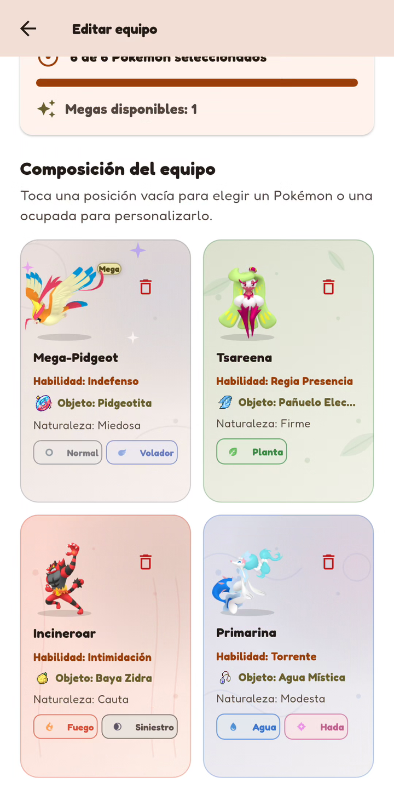

  <a href="README.md">Español</a> · <strong>English</strong>

# PokeChampions Core

### Competitive preparation. Damage analysis. Local data.

A mobile application for preparing teams and analysing Pokémon Champions without an account or server. A personal project by **[Diego de Arriba](https://github.com/DiegoARRFRA)** connecting product development, domain logic, persistence and Android validation.

**Flutter · Dart · Drift/SQLite · Modular architecture · Offline-first**

[Technical overview](docs/TECHNICAL_OVERVIEW.en.md) · [Database and diagrams](docs/DATABASE.en.md) · [Architecture](docs/ARCHITECTURE.en.md) · [Demos](docs/GALLERY.en.md) · [ES/EN documentation](docs/README.en.md)

> **Product and engineering showcase.** Production source is private. This repository presents the product, technical decisions and documented data model, not the implementation.

## Engineering in one minute

| Area | Implementation and responsibility |
| --- | --- |
| **Interface and product** | Flutter/Dart; team, calculation, lead-training and history tools; eight languages and light/dark/system themes. |
| **Architecture** | Feature-first organisation and layers; typed contracts, composition and constructor injection. Ports/adapters in key components. |
| **Calculation** | Explicit scenario → validation → rules and local catalogues → damage, KO or a documented limitation. |
| **Persistence** | Drift/SQLite, **11 tables in schema v2**; indexed columns and validated JSON content. Teams, notes, history, opponents and recovery. |
| **Concurrency** | Native storage on a Drift isolate; operations coordinated through a FIFO queue; a 1HITKO search worker with progress and cancellation. |
| **Reliability** | Transactions, draft identity and revision checks, preservation of previous data and storage exposure only after verification. |
| **Delivery and quality** | Dart/Flutter tests, static analysis, reproducible generation and scoped Android QA. Demos are not treated as tests. |

**Two separate paths:** analysis uses rules and packaged catalogues; saving uses repositories and SQLite. Each calculation does not depend on a server request.

## The working product

Home, a Versus result and the team editor. Real Android screenshots; select to enlarge.

  
  
  

### Versus in action

Select an attacker and move, calculate and inspect the result.

**[Watch MP4](media/demos/versus.mp4)** · [Teams and builds](docs/GALLERY.en.md#teams-and-builds) · [Lead Trainer](docs/GALLERY.en.md#lead-trainer) · [Full gallery](docs/GALLERY.en.md)

The gallery preserves the published demos and identifies older 1HITKO material. Recordings are edited for presentation, not benchmarks or certifications of the recorded build. Screenshots above retain the original Spanish interface. [Provenance](media/README.en.md).

## Decisions worth examining

| Engineering problem | Observable solution | Read more |
| --- | --- | --- |
| Avoid data loss when changing storage | Separate preparation, verification and activation; preserved originals and explicit failures. | [Migration and integrity](docs/DATABASE.en.md#migration-and-integrity) |
| Avoid duplicate matches or confirmation of a failed save | Transactional draft completion with identity and expected-revision checks. | [Save flow](docs/TECHNICAL_OVERVIEW.en.md#saving-a-match) |
| Share calculation without duplicating rules across screens | Typed contracts and service composition; separate scenario, evaluation and presentation. | [Architecture](docs/ARCHITECTURE.en.md) |
| Keep intensive work away from the interface | Isolated native storage and search execution with lifecycle control. | [Concurrency](docs/TECHNICAL_OVERVIEW.en.md#concurrency-and-state) |

## Evidence in context

The host campaign accepted on **20 September 2026** recorded **5,058 passing tests, 0 failures and 0 omissions**, in an ordinary serial run without filters. The earlier checkpoint from **14 September** retains its **4,849 passes**. These are distinct validation states; this documentation review neither reruns the suite nor certifies later changes.

Separate historical campaigns document **104,091 Versus scenarios** and **361 forms / 12,987 1HITKO pairs**. These sets are not additive and do not establish complete coverage of later builds. [Evidence matrix and scope](docs/VALIDATION.en.md).

Documented physical QA includes selected flows on **POCO F5 / Android 15**. The published performance case used an **emulator**, not an equivalent measurement on that phone. [Validation and limits](docs/VALIDATION.en.md) · [Performance case](docs/PERFORMANCE.en.md).

The **22 September 2026** documentary review of the schema and storage components expands the technical explanation, not application certification. Implementation and complete audit records remain private.

## Reading routes

**Product:** [features](docs/FEATURES.en.md) → [gallery](docs/GALLERY.en.md).  
**Technical review:** [full overview](docs/TECHNICAL_OVERVIEW.en.md) → [architecture](docs/ARCHITECTURE.en.md) → [database](docs/DATABASE.en.md) → [decisions and trade-offs](docs/ENGINEERING.en.md).  
**Quality:** [validation](docs/VALIDATION.en.md) → [performance](docs/PERFORMANCE.en.md) → [data and accuracy](docs/DATA_AND_ACCURACY.en.md).

## Author, status and scope

**Diego de Arriba** · [GitHub profile](https://github.com/DiegoARRFRA). A personal project in active development, presented through bilingual documentation and real demonstrations. [Participation](CONTRIBUTING.en.md) · [Roadmap](docs/ROADMAP.en.md).

Battle represents doubles situations; it does not execute complete matches. Lead Trainer practises initial choices and records manually entered outcomes. Battle History and Lead Trainer records are separate features. This repository provides neither production source nor a public app download, and publishes no user data, internal datasets, APKs, keys or music.

**Unofficial fan project.** Pokémon and related brands and assets belong to their respective rights holders. There is no affiliation, endorsement or sponsorship by Nintendo, Creatures, GAME FREAK or The Pokémon Company. This showcase grants no open-source licence. [Ownership](NOTICE.en.md).
