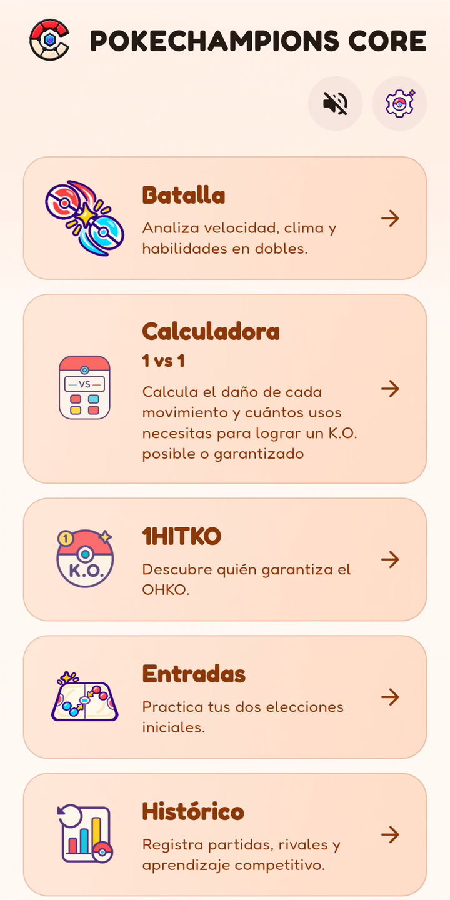
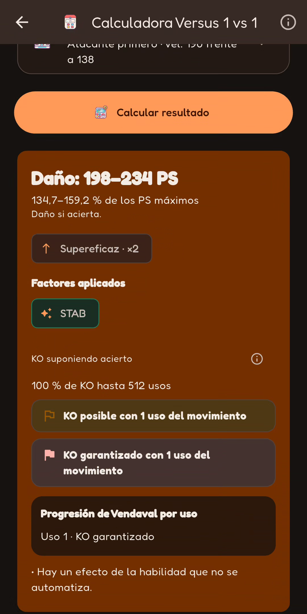
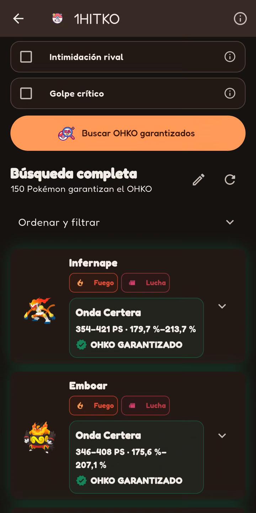
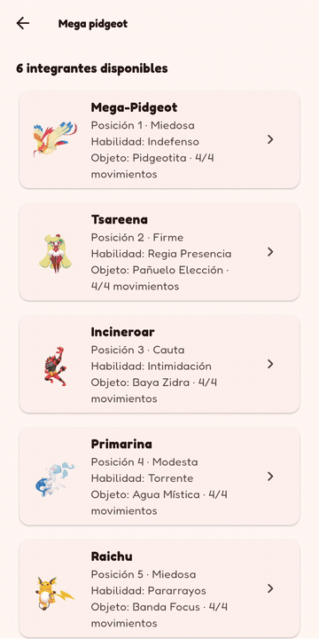
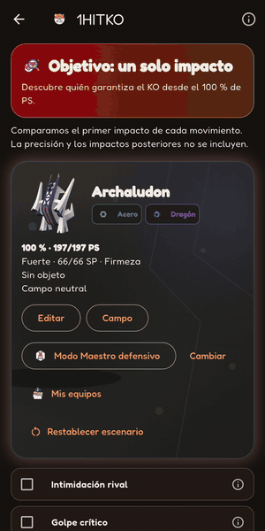
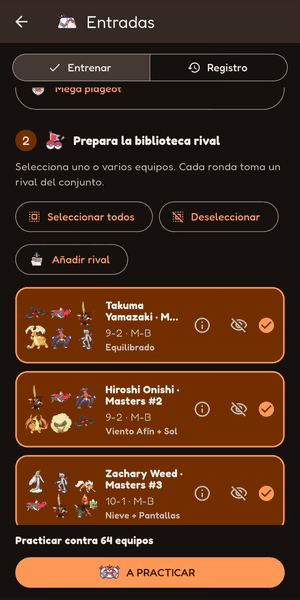
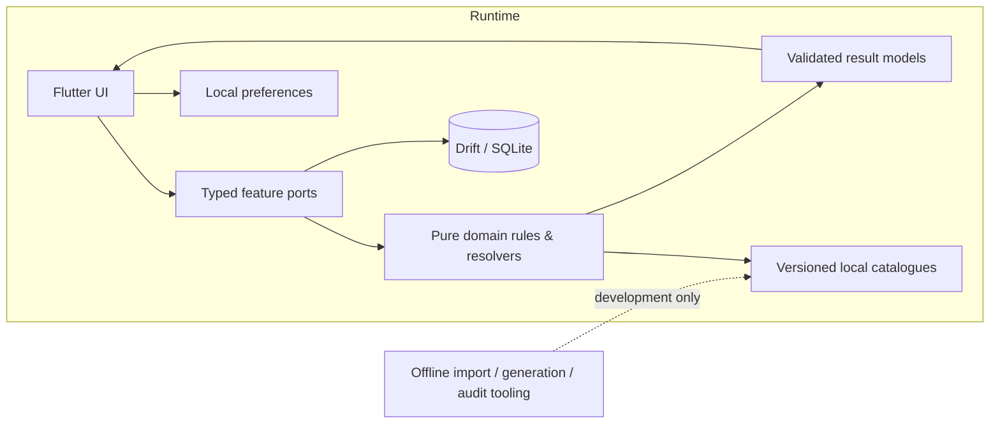

<p align="right">
  <a href="README.md">🇪🇸 Español</a> · <strong>🇬🇧 English</strong>
</p>

# PokeChampions Core

**A competitive companion for Pokémon Champions, built with Flutter and engineered around reproducible mechanics, explicit uncertainty and offline-first reliability.**


> **This is a public engineering showcase, not the application source repository.**  
> The production source code, private datasets, signing material, build internals and full audit evidence are intentionally not distributed here.

PokeChampions Core is an unofficial, offline-first mobile toolkit for competitive Pokémon Champions. It is designed to help players prepare teams, inspect battle situations, calculate damage, discover one-hit KOs, practise lead choices and review their own match history without depending on a live backend.

The project is also an engineering exercise in a harder problem: **how to make game-analysis tooling trustworthy when mechanics, regulations and upstream data evolve.** Instead of silently guessing, the application distinguishes verified behavior from insufficient context and keeps validation evidence scoped to the exact version that produced it.

## The application, in pictures

Real Android screenshots, using Spanish and the dark theme. Select an image to inspect it at a larger size.

<table>
  <tr><th>Home</th><th>Versus · damage result</th><th>1HITKO · search results</th></tr>
  <tr>
    <td align="center"><a href="media/screenshots/home.png"></a></td>
    <td align="center"><a href="media/screenshots/versus-result.png"></a></td>
    <td align="center"><a href="media/screenshots/1hitko-results.png"></a></td>
  </tr>
</table>

**[View the complete gallery: 8 screenshots](docs/GALLERY.en.md)** · Includes Battle, EV Lab, opening selection and practice records.

### Short demos

<table>
  <tr><th>Versus · ~13 s</th><th>1HITKO · ~13 s</th><th>Lead Trainer · ~15 s</th></tr>
  <tr>
    <td align="center"><a href="media/demos/versus.mp4"></a></td>
    <td align="center"><a href="media/demos/1hitko.mp4"></a></td>
    <td align="center"><a href="media/demos/entradas.mp4"></a></td>
  </tr>
  <tr>
    <td align="center"><a href="media/demos/versus.mp4">MP4 · higher resolution</a></td>
    <td align="center"><a href="media/demos/1hitko.mp4">MP4 · higher resolution</a></td>
    <td align="center"><a href="media/demos/entradas.mp4">MP4 · higher resolution</a></td>
  </tr>
</table>

Audio-free recordings at their original speed, followed by a short final-frame hold. No results were changed and no screens were generated. In Lead Trainer, outcomes are entered manually: this is not an automatically simulated battle. This material demonstrates the product; it does not replace a QA campaign or benchmark. [Editing and provenance notes](media/README.md#english).

## At a glance

| Area | Current engineering snapshot |
|---|---|
| Stack | Flutter / Dart, Drift + SQLite, local versioned datasets |
| Product model | Offline-first; no account or backend required |
| Localisation | 8 complete locale packages |
| Latest full host suite | **4,849 passed · 0 failed · 0 omitted** |
| Historical Versus validation | **104,091** scoped comparison scenarios |
| Historical 1HITKO campaign | **361 forms · 12,987 attacker/defender pairs** |
| Android validation | Physical QA on **POCO F5 / Android 15** plus emulator profiling |
| External QA build | **1.0.0+2**, validated through an update path on-device |
| Development status | Active; current public snapshot reflects validation through **2026-09-14** |

Validation figures belong to different, explicitly scoped checkpoints and are **not additive certifications**. New game data or mechanics are not automatically covered by older campaigns.

## What PokeChampions Core does

| Module | Purpose |
|---|---|
| **Team Builder** | Build and persist six-slot teams with forms, abilities, nature, training values, held items and moves. |
| **Battle** | Represent a doubles battle situation: speed order, weather, Tailwind, Trick Room, temporary HP and other verified context. It does not simulate entire turns. |
| **Versus** | 1v1 damage analysis backed by a typed calculation boundary shared by normal analysis and advanced tools. |
| **1HITKO** | Search the legal local catalogue for attackers capable of a guaranteed one-hit KO under an explicit scenario. |
| **EV Lab** | Explore defensive investment and survival thresholds against configured attacks. |
| **Lead Trainer** | Practise opening choices against curated competitive teams and review the resulting matchup. |
| **Battle History** | Keep local match records and immutable team snapshots for later analysis. |
| **Pokémon Notes** | Maintain a separate offline library of notes and reusable configurations. |
| **Appearance & localisation** | Light, dark and system themes plus eight atomic language packages. |

See [Features](docs/FEATURES.md) for the product boundary and current limitations.

## Engineering principles

PokeChampions Core is built around a small set of rules that shape both the architecture and the validation strategy:

- **Accuracy before convenience.** Unknown or unverified context should be exposed, blocked or documented instead of silently approximated.
- **Pure domain logic where possible.** UI widgets consume typed requests and responses rather than reconstructing mechanics from labels or presentation state.
- **Offline-first by design.** Runtime behavior consumes packaged, versioned data; external research and imports happen during development, not silently on the user's device.
- **Deterministic updates.** Data-generation and import steps are versioned and checked so a regulation update can be reproduced and reviewed.
- **Scoped evidence.** A historical green campaign stays historical. It is not reused as proof for later mechanics or newly added participants without new validation.
- **Safe persistence.** User-owned data is treated separately from generated catalogues and preferences, with migrations designed to preserve prior state.

## High-level architecture



The public documentation intentionally stops at architecture and behavior. Internal implementations, full datasets and the private calculation engine are not published in this repository.

Read more in [Architecture](docs/ARCHITECTURE.md) and [Engineering](docs/ENGINEERING.md).

## Validation philosophy

Testing is treated as evidence, not decoration. The private project maintains focused regression suites, large comparison campaigns, deterministic data checks and physical Android acceptance runs.

A recent full host run completed with **4,849 passes, zero failures and zero omissions** after a targeted import fix. Earlier campaigns include a **104,091-scenario** Versus comparison set and an exhaustive historical 1HITKO campaign across **361 forms and 12,987 pairs**. Physical acceptance has also covered installation, app identity, persistence, update behavior, navigation, appearance and selected competitive flows on a POCO F5 running Android 15.

Just as importantly, the project records what those tests **do not** prove. Device matrices, accessibility, long audio sessions and newly introduced regulation content may require separate evidence.

See [Validation & QA](docs/VALIDATION.md).

## Performance work

Startup profiling identified native audio initialisation on the critical path even when playback was not required. Moving that work behind explicit user activation reduced the measured **engine-to-first-frame median from ~3.69 s to ~0.395 s** in the first comparable emulator series, while warm wait time fell from **206 ms to 50 ms**.

The same audit deliberately did **not** claim total Android launch time as solved because emulator presentation remained unstable and later repeated measurements showed the platform could dominate end-to-end timing.

See [Performance](docs/PERFORMANCE.md) for the measurements and caveats.

## Data and mechanical authority

The application does not treat a single upstream as universally authoritative. The private data pipeline separates responsibility between official Pokémon Champions information, pinned technical references, explicit declarative overrides and generated artefacts. Human-readable descriptions never become mechanical authority by themselves.

When sources are insufficient to establish a Champions-specific interaction, the preferred outcome is **insufficient context or a documented block**, not an invented rule.

See [Data & Accuracy](docs/DATA_AND_ACCURACY.md).

## Repository map

```text
pokechampions-core-showcase/
├── README.md              # Español (default)
├── README.en.md           # English
├── NOTICE.md
├── CONTRIBUTING.md
├── media/
│   ├── README.md          # Provenance and editing
│   ├── manifest.json      # Inventory and SHA-256
│   ├── screenshots/       # 8 PNG screenshots
│   └── demos/             # 3 demos, each in GIF and MP4
└── docs/
    ├── GALLERY.md         # Spanish gallery
    ├── GALLERY.en.md      # English gallery
    ├── ARCHITECTURE.md
    ├── FEATURES.md
    ├── ENGINEERING.md
    ├── VALIDATION.md
    ├── PERFORMANCE.md
    ├── DATA_AND_ACCURACY.md
    └── ROADMAP.md
```

The gallery contains selected visual material, separate from the full recordings and the development project. This repository **is not a mirror of the private application source**.

## Public vs. private

**Published here:** product scope, engineering decisions, selected measurements, validation methodology, sanitized architecture, roadmap information and selected visual material.

**Kept private:** application source code, full internal datasets, signing keys, private audit packages, proprietary or third-party assets that should not be redistributed, and implementation details that would turn this showcase into a source mirror.

Feedback and product discussion are welcome; see [Contributing](CONTRIBUTING.md).

## Ownership and licensing

No open-source license is granted for this showcase repository unless a specific file or future subproject explicitly says otherwise. See [NOTICE.md](NOTICE.md).

## Disclaimer

PokeChampions Core is an **unofficial fan-made project**. Pokémon, Pokémon Champions and related names, characters, assets and trademarks belong to their respective rights holders. This project is not affiliated with, endorsed by or sponsored by Nintendo, Creatures, GAME FREAK or The Pokémon Company.
