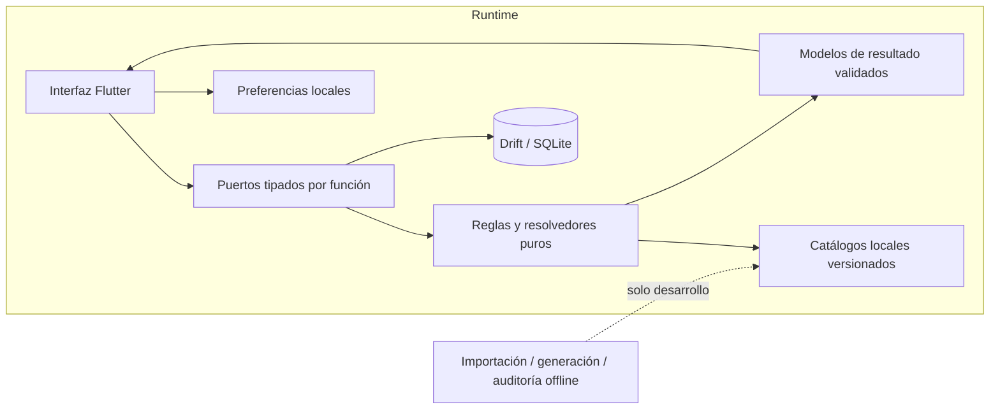

<p align="right">
  <strong>🇪🇸 Español</strong> · <a href="README.en.md">🇬🇧 English</a>
</p>

# PokeChampions Core

**Una herramienta competitiva para Pokémon Champions, desarrollada con Flutter y diseñada alrededor de mecánicas reproducibles, incertidumbre explícita y fiabilidad offline-first.**


> **Este es un escaparate público de ingeniería, no el repositorio del código fuente de la aplicación.**  
> El código de producción, los datasets privados, el material de firma, los detalles internos de compilación y la evidencia completa de auditoría no se distribuyen aquí de forma intencionada.

PokeChampions Core es una herramienta móvil no oficial y offline-first orientada al entorno competitivo de Pokémon Champions. Está diseñada para ayudar a preparar equipos, representar situaciones de batalla, calcular daño, descubrir KOs de un impacto, practicar elecciones de salida y revisar el historial propio de partidas sin depender de un backend en línea.

El proyecto también aborda un problema de ingeniería más difícil: **cómo hacer que una herramienta de análisis sea fiable cuando las mecánicas, las regulaciones y las fuentes externas evolucionan.** En lugar de completar huecos con aproximaciones silenciosas, la aplicación diferencia entre comportamiento verificado y contexto insuficiente, y mantiene la evidencia de validación vinculada al alcance exacto que la produjo.

## La aplicación, en imágenes

Capturas reales de Android, en español y tema oscuro. Pulsa una imagen para verla a mayor tamaño.

<table>
  <tr><th>Inicio</th><th>Versus · resultado</th><th>1HITKO · resultados</th></tr>
  <tr>
    <td align="center"><a href="media/screenshots/home.png"></a></td>
    <td align="center"><a href="media/screenshots/versus-result.png"></a></td>
    <td align="center"><a href="media/screenshots/1hitko-results.png"></a></td>
  </tr>
</table>

**[Ver la galería completa: 8 capturas](docs/GALLERY.md)** · Incluye Batalla, EV Lab, selección de Entradas y registro de prácticas.

### Demos breves

<table>
  <tr><th>Versus · ~13 s</th><th>1HITKO · ~13 s</th><th>Entradas · ~15 s</th></tr>
  <tr>
    <td align="center"><a href="media/demos/versus.mp4"></a></td>
    <td align="center"><a href="media/demos/1hitko.mp4"></a></td>
    <td align="center"><a href="media/demos/entradas.mp4"></a></td>
  </tr>
  <tr>
    <td align="center"><a href="media/demos/versus.mp4">MP4 · mayor resolución</a></td>
    <td align="center"><a href="media/demos/1hitko.mp4">MP4 · mayor resolución</a></td>
    <td align="center"><a href="media/demos/entradas.mp4">MP4 · mayor resolución</a></td>
  </tr>
</table>

Grabaciones sin audio, a velocidad original y con una breve pausa final. No se han cambiado resultados ni generado pantallas. En Entradas, el resultado se introduce manualmente: no es una simulación automática del combate. Este material muestra el producto; no sustituye a una campaña de QA ni a un benchmark. [Detalles de edición y procedencia](media/README.md).

## De un vistazo

| Área | Estado técnico actual |
|---|---|
| Stack | Flutter / Dart, Drift + SQLite, datasets locales versionados |
| Modelo de producto | Offline-first; no requiere cuenta ni backend |
| Localización | 8 paquetes de idioma completos |
| Última suite completa en host | **4.849 correctos · 0 fallos · 0 omisiones** |
| Validación histórica de Versus | **104.091** escenarios de comparación acotados |
| Campaña histórica 1HITKO | **361 formas · 12.987 pares atacante/defensor** |
| Validación Android | QA física en **POCO F5 / Android 15** y perfilado en emulador |
| Build externa de QA | **1.0.0+2**, validada mediante actualización en dispositivo |
| Estado de desarrollo | Activo; este escaparate refleja validaciones hasta **2026-09-14** |

Las cifras de validación pertenecen a checkpoints distintos y con alcance explícito. **No deben sumarse ni interpretarse como una única certificación global.** Los nuevos datos o mecánicas no heredan automáticamente la cobertura de campañas anteriores.

## Qué hace PokeChampions Core

| Módulo | Función |
|---|---|
| **Team Builder** | Crear y conservar equipos de seis posiciones con formas, habilidades, naturaleza, valores de entrenamiento, objetos y movimientos. |
| **Batalla** | Representar una situación de dobles: orden de Velocidad, clima, Viento Afín, Espacio Raro, PS temporales y otro contexto verificado. No simula turnos completos. |
| **Versus** | Análisis de daño 1 vs 1 mediante una frontera de cálculo tipada compartida por el análisis normal y las herramientas avanzadas. |
| **1HITKO** | Buscar en el catálogo local legal atacantes capaces de garantizar un KO de un impacto bajo un escenario explícito. |
| **EV Lab** | Explorar inversión defensiva y umbrales de supervivencia frente a ataques configurados. |
| **Entradas** | Practicar elecciones iniciales contra equipos competitivos curados y revisar el emparejamiento resultante. |
| **HISTÓRICO** | Conservar partidas y snapshots inmutables de equipos para su revisión posterior. |
| **Notas Pokémon** | Mantener una biblioteca offline independiente de notas y configuraciones reutilizables. |
| **Apariencia y localización** | Temas Claro, Oscuro y Sistema, además de ocho paquetes de idioma atómicos. |

Consulta [Features](docs/FEATURES.md) para ver el límite funcional y las limitaciones actuales.

## Principios de ingeniería

PokeChampions Core se construye alrededor de un conjunto pequeño de reglas que condicionan tanto la arquitectura como la estrategia de validación:

- **Exactitud antes que comodidad.** Un contexto desconocido o no verificado debe mostrarse, bloquearse o documentarse, no aproximarse en silencio.
- **Lógica de dominio pura siempre que sea posible.** Los widgets consumen peticiones y respuestas tipadas en lugar de reconstruir mecánicas a partir de etiquetas o estado visual.
- **Offline-first por diseño.** El runtime consume datos empaquetados y versionados; la investigación externa y las importaciones se realizan durante el desarrollo, no de forma silenciosa en el dispositivo del usuario.
- **Actualizaciones deterministas.** La generación e importación de datos se versionan y verifican para que una actualización de regulación pueda reproducirse y revisarse.
- **Evidencia con alcance.** Una campaña histórica que terminó correctamente sigue siendo histórica; no se reutiliza como prueba automática para mecánicas o participantes añadidos después.
- **Persistencia segura.** Los datos del usuario se mantienen separados de catálogos generados y preferencias, con migraciones diseñadas para preservar estados anteriores.

## Arquitectura de alto nivel



La documentación pública se detiene deliberadamente en la arquitectura y el comportamiento. Las implementaciones internas, los datasets completos y el motor privado de cálculo no se publican en este repositorio.

Más información en [Architecture](docs/ARCHITECTURE.md) y [Engineering](docs/ENGINEERING.md).

## Filosofía de validación

Las pruebas se tratan como **evidencia**, no como decoración. El proyecto privado mantiene suites de regresión focales, campañas de comparación de gran tamaño, verificaciones deterministas de datos y recorridos de aceptación física en Android.

Una ejecución completa reciente en host terminó con **4.849 aciertos, cero fallos y cero omisiones** después de una corrección focal de importación. Entre las campañas anteriores se encuentra un conjunto de comparación de Versus de **104.091 escenarios** y una campaña histórica exhaustiva de 1HITKO sobre **361 formas y 12.987 pares**. La aceptación física también ha cubierto instalación, identidad de la app, persistencia, actualización, navegación, apariencia y flujos competitivos seleccionados en un POCO F5 con Android 15.

Igual de importante es registrar lo que esas pruebas **no demuestran**. La matriz de dispositivos, accesibilidad, sesiones prolongadas de audio o contenido incorporado por regulaciones posteriores pueden necesitar evidencia separada.

Consulta [Validation & QA](docs/VALIDATION.md).

## Trabajo de rendimiento

El perfilado del arranque detectó que la inicialización nativa de audio estaba en la ruta crítica incluso cuando no era necesaria la reproducción. Mover ese trabajo detrás de una activación explícita del usuario redujo la mediana medida desde **motor hasta primer frame de ~3,69 s a ~0,395 s** en la primera serie comparable del emulador. El tiempo de espera en arranque caliente pasó de **206 ms a 50 ms**.

La misma auditoría evitó declarar resuelto el tiempo total de arranque Android porque la presentación del emulador siguió siendo inestable y mediciones posteriores mostraron que la plataforma podía dominar el tiempo extremo a extremo.

Consulta [Performance](docs/PERFORMANCE.md) para ver las mediciones y sus límites.

## Autoridad de datos y mecánicas

La aplicación no considera una única fuente como autoridad universal. El pipeline privado de datos separa responsabilidades entre información oficial de Pokémon Champions, referencias técnicas fijadas por revisión, overrides declarativos explícitos y artefactos generados. Las descripciones destinadas a lectura humana nunca se convierten por sí solas en autoridad mecánica.

Cuando las fuentes no bastan para demostrar una interacción específica de Champions, el resultado preferido es **contexto insuficiente o un bloqueo documentado**, no una regla inventada.

Consulta [Data & Accuracy](docs/DATA_AND_ACCURACY.md).

## Mapa del repositorio

```text
pokechampions-core-showcase/
├── README.md              # Español (predeterminado)
├── README.en.md           # English
├── NOTICE.md
├── CONTRIBUTING.md
├── media/
│   ├── README.md          # Procedencia y edición
│   ├── manifest.json      # Inventario y SHA-256
│   ├── screenshots/       # 8 capturas PNG
│   └── demos/             # 3 demos, cada una en GIF y MP4
└── docs/
    ├── GALLERY.md         # Galería en español
    ├── GALLERY.en.md      # English gallery
    ├── ARCHITECTURE.md
    ├── FEATURES.md
    ├── ENGINEERING.md
    ├── VALIDATION.md
    ├── PERFORMANCE.md
    ├── DATA_AND_ACCURACY.md
    └── ROADMAP.md
```

La galería incorpora material visual seleccionado, separado de los originales completos y del proyecto de desarrollo. Este repositorio **no es un espejo del código fuente privado**.

## Público frente a privado

**Publicado aquí:** alcance del producto, decisiones de ingeniería, mediciones seleccionadas, metodología de validación, arquitectura saneada, hoja de ruta y material visual seleccionado.

**Se mantiene privado:** código fuente de la aplicación, datasets internos completos, claves de firma, paquetes privados de auditoría, assets propietarios o de terceros que no deban redistribuirse y detalles de implementación que convertirían este escaparate en un espejo del código.

El feedback y la discusión sobre el producto son bienvenidos; consulta [Contributing](CONTRIBUTING.md).

## Propiedad y licencia

Este repositorio de showcase **no concede una licencia open source**, salvo que un archivo o subproyecto futuro indique expresamente lo contrario. Consulta [NOTICE.md](NOTICE.md).

## Aviso legal

PokeChampions Core es un **proyecto fan no oficial**. Pokémon, Pokémon Champions y sus nombres, personajes, recursos y marcas relacionadas pertenecen a sus respectivos titulares. Este proyecto no está afiliado, respaldado ni patrocinado por Nintendo, Creatures, GAME FREAK ni The Pokémon Company.
