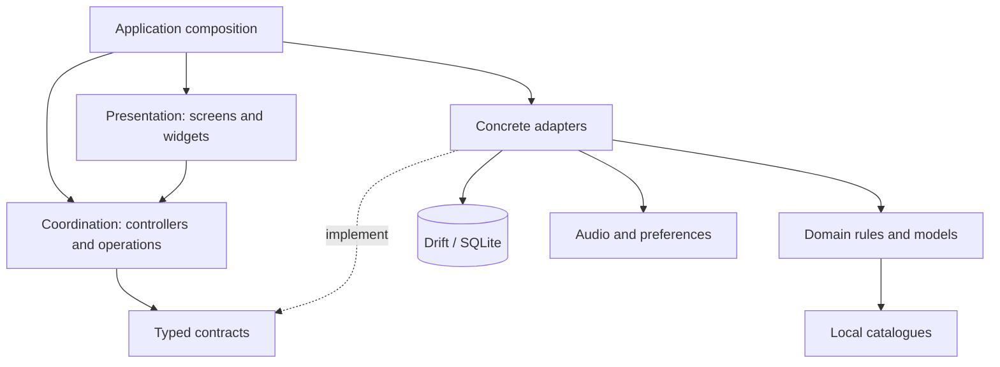
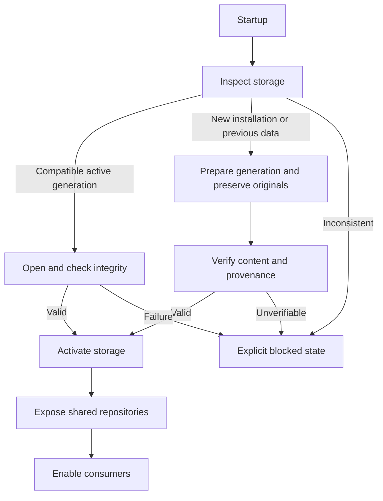

<p align="right">
  <a href="ARCHITECTURE.md">Español</a> · <strong>English</strong>
</p>

# System architecture

[← Overview](../README.en.md) · [Technical overview](TECHNICAL_OVERVIEW.en.md) · [Database](DATABASE.en.md) · [Documentation](README.en.md)

## Architectural style

**A modular, feature-first application with layered separation and ports/adapters in key components.** It is one local application, not a microservice system. A “port” is an internal code contract, not a REST endpoint.

These boundaries allow services to be replaced at specific points. The entire project is not described as purely hexagonal: some controllers and composition depend on Flutter, and feature folders are not organised identically everywhere.

## Layers and dependencies



A responsibility view. It does not represent every import or require all data access to pass through one adapter. Implementations are connected at composition points; consumers receive the dependencies they need.

| Responsibility | Purpose | Not to be confused with |
| --- | --- | --- |
| Presentation | Input, navigation, results and visual state. | Deriving rules from translations. |
| Coordination | Prepare requests, start tasks and manage their lifecycle. | All domain logic or complete independence from Flutter. |
| Domain | Rules, models and results within product scope. | A complete turn simulator. |
| Contracts | Typed boundaries between consumer and implementation. | A public network API. |
| Adapters | SQL repositories, playback and resource access. | A collection of microservices. |
| Composition | Construct/connect implementations and share ownership. | Opening new connections from each widget. |

## Two concrete examples

**Versus.** The feature entry resolves catalogues and supplies a calculation contract to the controller. The concrete facade fulfils that contract; composition accepts an alternative implementation. Scenario and response are typed. This boundary keeps the normal screen from needing to know every evaluator implementation detail.

**Audio.** The controller receives its player, preference repository and session through contracts. The playback adapter encapsulates `just_audio`. Controller state still uses Flutter mechanisms: provider separation is real, but the controller is not portrayed as framework-independent.

## Project organisation

A responsibility map, not a public distribution of internal files:

```text
Application
  Composition, startup and dependency ownership
Shared core
  Models, rules, catalogues, storage, themes and languages
Features
  Teams, Versus, 1HITKO, Lead Trainer, History, Notes, Audio
  Presentation / coordination / data or infrastructure as appropriate
Shared components
  Reusable interface elements
Development tooling
  Generation, import, tests and validation
```

This avoids claiming a folder symmetry the project does not have. Importers and audit artefacts are not a running backend.

## Startup and storage exposure



A summarised startup view, not the complete state machine. While storage is preparing or blocked, the normal scope does not silently fall back to previous repositories. Retry depends on error classification; reopening does not fix every failure.

## Product boundaries

Battle analyses a 2v2 situation; Versus evaluates damage; 1HITKO searches candidates; EV Lab explores survival; Lead Trainer practises initial choices; Battle History retains declared outcomes. Scenario transfers between tools do not make the composition an automatic match engine.

Teams and practice rounds share storage mechanisms but retain distinct contracts. Battle History stores its own records, draft and opponent versions. [Physical model and logical associations](DATABASE.en.md).

## What an external reader can review

This documentation exposes responsibilities, data design, boundaries and trade-offs, alongside demos and selected evidence. It does not make the entire application reproducible from the showcase: source, datasets and the private test corpus remain unpublished. Diagrams summarise implementation reviewed on 22 September 2026; they are not a new whole-codebase audit.

[Engineering decisions](ENGINEERING.en.md) · [Operational flows](TECHNICAL_OVERVIEW.en.md) · [Quality and limits](VALIDATION.en.md)
