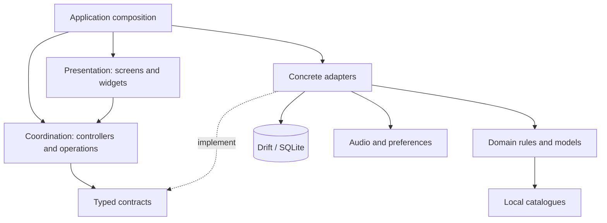
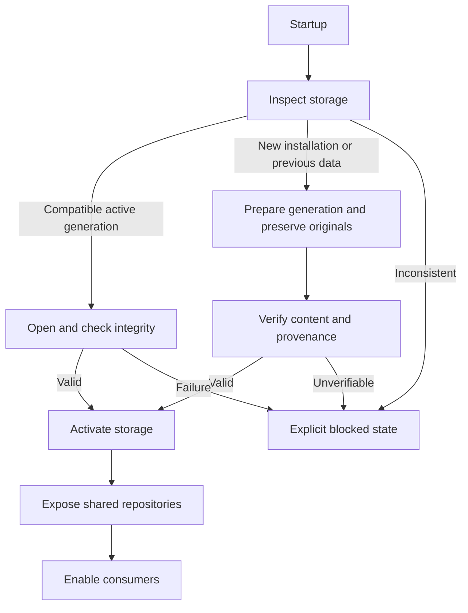

<p align="right">
  <a href="ARCHITECTURE.md">Español</a> · <strong>English</strong>
</p>

# System architecture

[← Overview](../README.en.md) · [Technical overview](TECHNICAL_OVERVIEW.en.md) · [Database](DATABASE.en.md) · [Documentation](README.en.md)

## Organisation

The application is organised by feature, with presentation, coordination, domain and data-access layers. Typed contracts and constructor injection allow calculation, storage and audio services to be replaced.

Modules share models, rules and interface resources. Composition and some controllers depend on Flutter; isolatable domain components remain independent of screens. Each feature's internal structure follows its requirements.

## Layers and dependencies



Composition connects implementations; each consumer receives its dependencies. The diagram groups responsibilities and usage relationships.

| Layer | Responsibility |
| --- | --- |
| **Presentation** | Input, navigation, loading states and result display. |
| **Coordination** | Request preparation, operation execution and lifecycle management. |
| **Domain** | Rules, scenario models and calculation results. |
| **Contracts** | Typed interfaces between consumers and services. |
| **Adapters** | SQL access, resource reads, preferences and audio playback. |
| **Composition** | Construction of implementations and shared resource ownership. |

## Versus

The feature entry loads catalogues and supplies a calculation contract to the controller. A facade implements that contract; composition accepts an alternative for tests or other consumers.

The screen works with typed scenarios and responses. Rules are evaluated outside widgets, so presentation changes do not require rewriting the evaluator.

## Audio

The controller receives a player, preference repository and session. The playback adapter encapsulates `just_audio`; the controller coordinates state through Flutter mechanisms.

This separation allows coordination to be tested with silent or in-memory implementations without starting the native player.

## Project structure

```text
Application
  Composition, startup and dependency ownership
Shared core
  Models, rules, catalogues, storage, themes and languages
Features
  Teams, Versus, 1HITKO, Lead Trainer, History, Notes, Audio
  Presentation / coordination / data or infrastructure as appropriate
Shared components
  Reusable interface elements
Development tooling
  Generation, import, tests and validation
```

Generators and importers prepare resources during development. The application consumes those resources locally.

## Startup and storage exposure



Repositories are exposed when storage is ready. Consumers do not silently fall back to another store while it is preparing or blocked. Access errors allow a retry; integrity or compatibility errors require their cause to be resolved.

Repositories share a connection and its operation queue. The owner coordinates opening and waits for admitted actions before closing.

## Feature relationships

Teams and Notes provide reusable configurations. Versus calculates damage, EV Lab searches defensive spreads and 1HITKO searches candidates. Battle compares speed and effects in a doubles situation. Lead Trainer uses those teams for opening-choice practice and records the outcome entered by the user.

Battle History maintains matches, a draft and opponent profiles/versions. Its data is separate from Lead Trainer's practice records, although both use the shared persistence infrastructure.

[Data model](DATABASE.en.md) · [Engineering decisions](ENGINEERING.en.md) · [Operational flows](TECHNICAL_OVERVIEW.en.md) · [Tests](VALIDATION.en.md)
