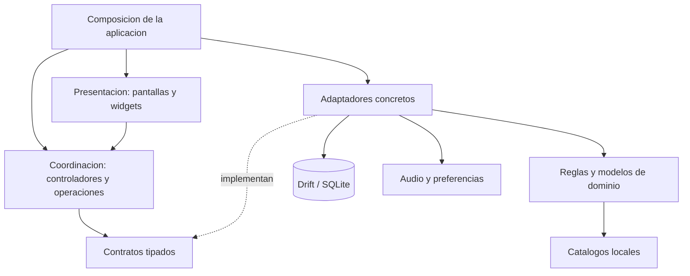

<p align="right">
  <strong>Español</strong> · <a href="ARCHITECTURE.en.md">English</a>
</p>

# Arquitectura del sistema

[← Portada](../README.md) · [Ficha técnica](TECHNICAL_OVERVIEW.md) · [Base de datos](DATABASE.md) · [Documentación](README.md)

## Organización

La aplicación se organiza por funcionalidades, con capas de presentación, coordinación, dominio y acceso a datos. Los contratos tipados y la inyección por constructor permiten sustituir servicios de cálculo, almacenamiento y audio.

Los módulos comparten modelos, reglas y recursos de interfaz. La composición y algunos controladores dependen de Flutter; los componentes de dominio aislables se mantienen independientes de las pantallas. La estructura interna se adapta a las necesidades de cada funcionalidad.

## Capas y dependencias



La composición conecta las implementaciones; cada consumidor recibe sus dependencias. El diagrama agrupa responsabilidades y relaciones de uso.

| Capa | Responsabilidad |
| --- | --- |
| **Presentación** | Entrada de datos, navegación, estados de carga y visualización de resultados. |
| **Coordinación** | Preparación de peticiones, ejecución de operaciones y gestión de su ciclo de vida. |
| **Dominio** | Reglas, modelos de escenario y resultados de cálculo. |
| **Contratos** | Interfaces tipadas entre consumidores y servicios. |
| **Adaptadores** | Acceso SQL, lectura de recursos, preferencias y reproducción de audio. |
| **Composición** | Creación de implementaciones y propiedad compartida de sus recursos. |

## Versus

La entrada de la funcionalidad carga los catálogos y entrega al controlador un contrato de cálculo. Una fachada implementa ese contrato; la composición admite una alternativa para pruebas u otros consumidores.

La pantalla trabaja con escenarios y respuestas tipadas. Las reglas se resuelven fuera de los widgets, de modo que cambios de presentación no requieren reescribir el evaluador.

## Audio

El controlador recibe un reproductor, un repositorio de preferencias y una sesión. El adaptador de reproducción encapsula `just_audio`; el controlador coordina el estado mediante los mecanismos de Flutter.

Esta separación permite probar la coordinación con implementaciones silenciosas o en memoria, sin iniciar el reproductor nativo.

## Estructura del proyecto

```text
Aplicacion
  Composicion, arranque y propiedad de dependencias
Nucleo compartido
  Modelos, reglas, catalogos, almacenamiento, temas e idiomas
Funcionalidades
  Equipos, Versus, 1HITKO, Entradas, Historico, Notas, Audio
  Presentacion / coordinacion / datos o infraestructura segun el modulo
Componentes compartidos
  Elementos reutilizables de interfaz
Herramientas de desarrollo
  Generacion, importacion, pruebas y validacion
```

Los generadores e importadores preparan los recursos durante el desarrollo. La aplicación consume esos recursos localmente.

## Arranque y publicación del almacenamiento

```mermaid
flowchart TB
    START["Arranque"] --> CHECK["Inspeccionar almacenamiento"]
    CHECK -->|"Generacion activa compatible"| OPEN["Abrir y comprobar integridad"]
    CHECK -->|"Instalacion nueva o datos anteriores"| PREP["Preparar generacion y conservar originales"]
    PREP --> VERIFY["Verificar contenido y procedencia"]
    VERIFY -->|"Correcto"| ACTIVE["Activar almacenamiento"]
    OPEN -->|"Correcto"| ACTIVE
    CHECK -->|"Inconsistente"| BLOCK["Estado bloqueado explicito"]
    VERIFY -->|"No verificable"| BLOCK
    OPEN -->|"Error"| BLOCK
    ACTIVE --> SCOPE["Publicar repositorios compartidos"]
    SCOPE --> UI["Habilitar consumidores"]
```



Los repositorios se exponen cuando el almacenamiento está listo. Mientras se prepara o se encuentra bloqueado, los consumidores no pasan silenciosamente a otro almacén. Los errores de acceso admiten reintento; los de integridad o compatibilidad requieren resolver su causa.

Los repositorios comparten una conexión y su cola de operaciones. Su propietario coordina la apertura y espera a las acciones admitidas antes de cerrar.

## Relación entre funcionalidades

Equipos y Notas proporcionan configuraciones reutilizables. Versus calcula daño; EV Lab busca repartos defensivos; 1HITKO recorre candidatos. Batalla compara Velocidad y efectos en una situación de dobles. Entradas utiliza esos equipos para practicar elecciones iniciales y registra el resultado que introduce el usuario.

HISTÓRICO mantiene partidas, borrador y perfiles/versiones de rivales. Sus datos son distintos del registro de prácticas de Entradas, aunque ambos utilizan la infraestructura de persistencia compartida.

[Modelo de datos](DATABASE.md) · [Decisiones de ingeniería](ENGINEERING.md) · [Flujos operativos](TECHNICAL_OVERVIEW.md) · [Pruebas](VALIDATION.md)
