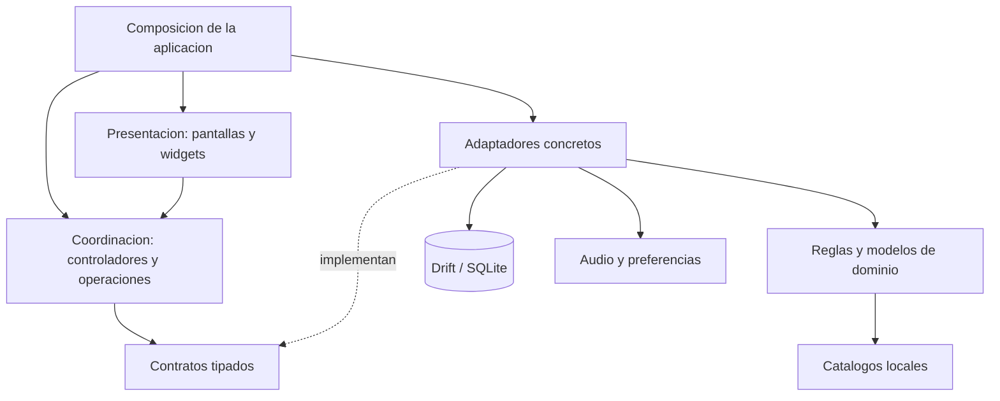
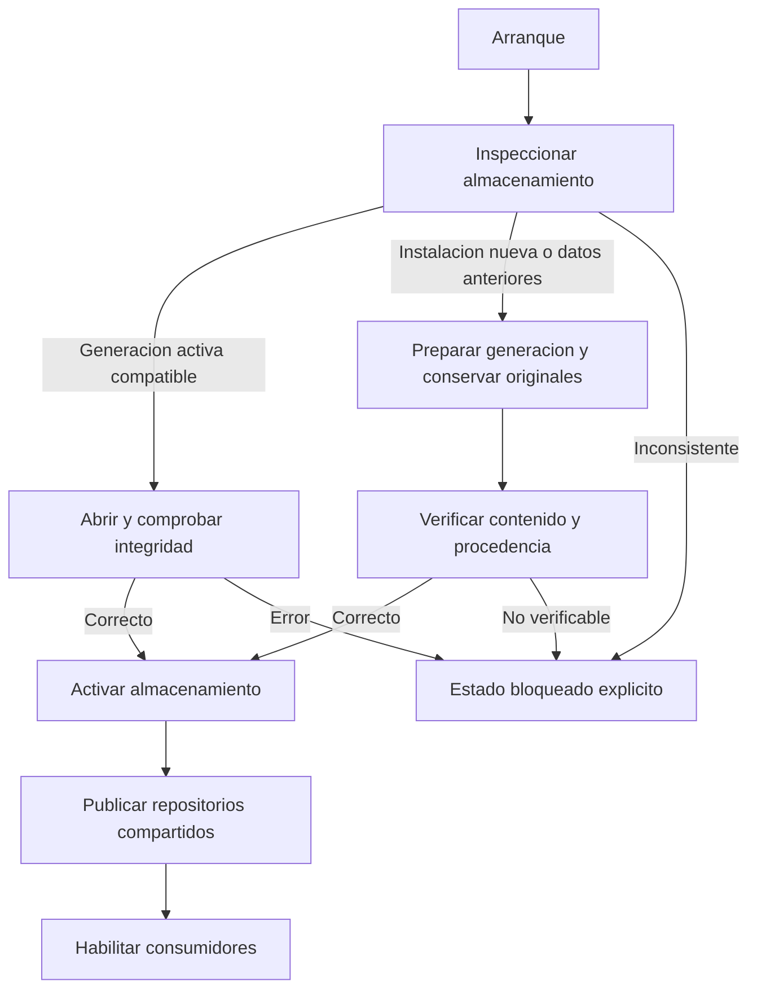

<p align="right">
  <strong>Español</strong> · <a href="ARCHITECTURE.en.md">English</a>
</p>

# Arquitectura del sistema

[← Portada](../README.md) · [Ficha técnica](TECHNICAL_OVERVIEW.md) · [Base de datos](DATABASE.md) · [Documentación](README.md)

## Estilo arquitectónico

**Aplicación modular organizada por funcionalidades —feature-first—, con separación por capas y puertos/adaptadores en componentes clave.** Es una única aplicación local, no un sistema de microservicios. “Puerto” significa un contrato interno de código; no un endpoint REST.

La separación permite sustituir servicios en puntos concretos. No se describe todo el proyecto como hexagonal puro: ciertos controladores y la composición dependen de Flutter, y la distribución de carpetas no es idéntica en todas las funcionalidades.

## Capas y dependencias



Vista por responsabilidades. No representa cada import ni exige que todo acceso a datos atraviese el mismo adaptador. Las implementaciones se conectan en composición; los consumidores reciben las dependencias que necesitan.

| Responsabilidad | Qué resuelve | Qué no debe confundirse con ella |
| --- | --- | --- |
| Presentación | Entrada, navegación, resultado y estados visuales. | Interpretar reglas desde traducciones. |
| Coordinación | Preparar peticiones, iniciar tareas y gestionar su ciclo de vida. | Toda la lógica de dominio ni independencia total de Flutter. |
| Dominio | Reglas, modelos y resultados dentro del alcance del producto. | Un simulador completo de turnos. |
| Contratos | Límite tipado entre consumidor e implementación. | Una API pública de red. |
| Adaptadores | Repositorios SQL, reproducción y acceso a recursos. | Una colección de microservicios. |
| Composición | Crear/conectar implementaciones y compartir su propiedad. | Abrir conexiones nuevas desde cada widget. |

## Dos ejemplos concretos

**Versus.** La entrada de la funcionalidad resuelve catálogos y entrega al controlador un contrato de cálculo. La fachada concreta satisface ese contrato; la composición admite una implementación alternativa. El escenario y la respuesta son tipados. La separación evita que la pantalla normal tenga que conocer todos los detalles de la implementación del evaluador.

**Audio.** El controlador recibe reproductor, repositorio de preferencias y sesión mediante contratos. El adaptador de reproducción encapsula `just_audio`. El estado del controlador sí usa mecanismos de Flutter: se separa el proveedor, no se finge un controlador totalmente ajeno al framework.

## Organización del proyecto

Mapa orientativo de responsabilidades; no es una distribución pública de archivos internos:

```text
Aplicacion
  Composicion, arranque y propiedad de dependencias
Nucleo compartido
  Modelos, reglas, catalogos, almacenamiento, temas e idiomas
Funcionalidades
  Equipos, Versus, 1HITKO, Entradas, Historico, Notas, Audio
  Presentacion / coordinacion / datos o infraestructura segun el modulo
Componentes compartidos
  Elementos reutilizables de interfaz
Herramientas de desarrollo
  Generacion, importacion, pruebas y validacion
```

El árbol evita prometer una simetría de carpetas que el proyecto no tiene. Importadores y artefactos de auditoría no forman parte de un backend en ejecución.

## Arranque y publicación del almacenamiento



Es una vista resumida del arranque, no la máquina de estados completa. Mientras el almacenamiento se prepara o está bloqueado, el ámbito normal no recurre silenciosamente a los repositorios anteriores. El reintento está condicionado a la clasificación del error; no todos los fallos se resuelven repitiendo la apertura.

## Límites del producto

Batalla analiza una situación 2v2; Versus evalúa daño; 1HITKO busca candidatos; EV Lab explora supervivencia; Entradas practica elecciones iniciales; HISTÓRICO conserva resultados declarados. Las transferencias de escenarios entre herramientas no convierten esa composición en una partida automática.

Equipos y rondas de Entradas comparten mecanismos de almacenamiento, pero mantienen contratos distintos. HISTÓRICO almacena sus propios registros, borrador y versiones de rival. [Modelo físico y asociaciones lógicas](DATABASE.md).

## Qué puede revisar un lector externo

Esta documentación permite examinar responsabilidades, diseño de datos, límites y compromisos, junto con demos y evidencia seleccionada. No permite reproducir toda la aplicación desde el showcase: el código, los datasets y el corpus privado de pruebas no se publican. Los diagramas son resúmenes de la implementación revisada el 22 de septiembre de 2026, no una nueva auditoría del código completo.

[Decisiones de ingeniería](ENGINEERING.md) · [Flujos operativos](TECHNICAL_OVERVIEW.md) · [Calidad y límites](VALIDATION.md)
