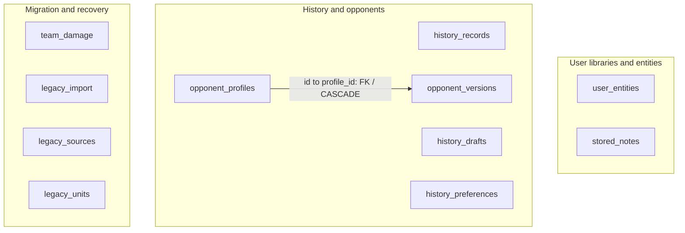
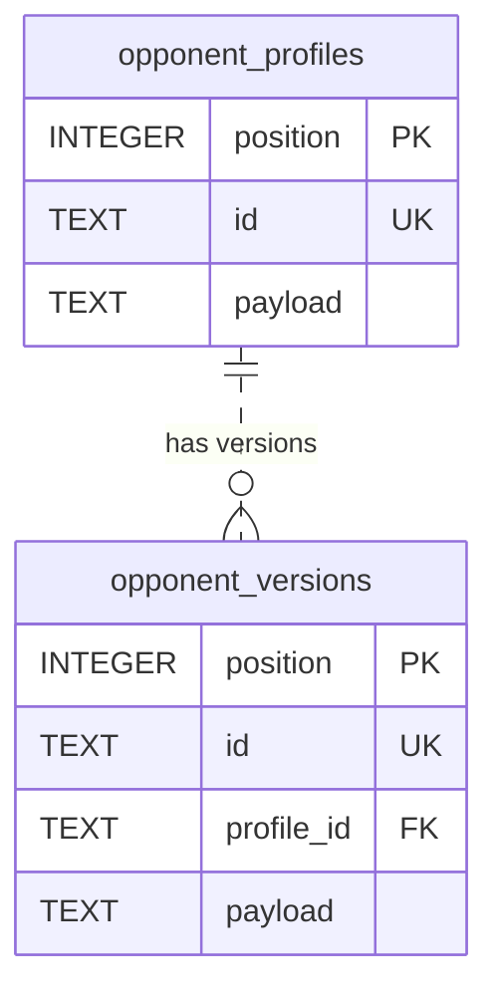
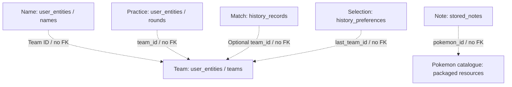

  <a href="DATABASE.md">Español</a> · <strong>English</strong>

# Database and persistence model

[← Overview](../README.en.md) · [Technical overview](TECHNICAL_OVERVIEW.en.md) · [Documentation](README.en.md)

**SQLite · Drift · Schema v2 · 11 tables · 4 explicit secondary indexes · 1 declared foreign key**

## Data organisation

SQLite stores the user's teams, notes, matches, drafts, opponents and practice records, along with migration control. Pokémon, move and ability catalogues are packaged resources outside the database. Language, appearance and audio use separate preferences.

The model combines relational columns for identifying, ordering and indexing records with JSON documents for composite content. Codecs interpret those documents and validate application models. A team's members, moves and stats are part of its content rather than separate tables.

## Complete physical map

Boxes represent tables. The arrow shows the declared foreign key between opponent profiles and versions.

### Declared referential relationship

Each version belongs to one profile; a profile can have zero or more versions. The FK references the profile's **unique `id`**, not its `position` PK, and declares **`ON DELETE CASCADE`**. The dashed ER line represents a non-identifying relationship: each version retains its own identity.

`history_records.team_id`, `history_preferences.last_team_id`, `user_entities.team_id` and `stored_notes.pokemon_id` are application-managed associations without declared FKs. Migration tables also have no FK relationships between them.

## Logical product associations

This map shows ID references separately from SQL referential integrity.

Match and practice snapshots retain information from the recorded moment within the JSON document. Deleting a team does not imply an SQL cascade over its history. Notes use an ID from the packaged catalogue, outside the SQLite file.

## Table dictionary

`PK`: primary key. `UK`: uniqueness. `FK`: foreign key. `?`: nullable. JSON is stored as `TEXT`.

Open the complete 11-table dictionary

### 1. stored_notes

| Field | Type and contract |
| --- | --- |
| `position` | INTEGER, autoincrement PK; storage order. |
| `id` | TEXT, UK, required and non-empty after trim. |
| `pokemon_id` | Required TEXT; catalogue association, no SQL FK. |
| `payload` | Required TEXT with `json_valid`; note content. |

### 2. history_records

| Field | Type and contract |
| --- | --- |
| `position` | INTEGER, autoincrement PK. |
| `id` | TEXT, UK, required and non-empty after trim. |
| `team_id` | TEXT?; team selection and filtering, no FK. |
| `played_at` | Required INTEGER; the repository writes microseconds since epoch. |
| `outcome` | Required TEXT; CHECK restricted to `victory` or `defeat`. |
| `payload` | Required TEXT with `json_valid`; serialised record and snapshots. |

### 3. history_drafts

| Field | Type and contract |
| --- | --- |
| `slot` | INTEGER PK, CHECK `slot = 1`: at most one row. |
| `revision` | TEXT?; when present it cannot be empty after trim. |
| `payload` | Required TEXT with `json_valid`; serialised draft. |

The repository checks revision during draft completion. The column CHECK validates its format; concurrency control takes place within the operation.

### 4–5. opponent_profiles and opponent_versions

Both tables have `position` INTEGER autoincrement PK, unique `id` TEXT that is non-empty after trim, and required `payload` TEXT with `json_valid`.

`opponent_versions` adds required `profile_id` TEXT, an FK to profile `id` with cascading deletion. Versions retain configurations associated with an opponent separately from the user's own teams.

### 6. history_preferences

`slot` INTEGER PK with CHECK `slot = 1`, and required `last_team_id` TEXT that is non-empty after trim. It stores Battle History's last team selection. The table holds zero or one row and is independent of visual preferences.

### 7. user_entities

| Field | Type and contract |
| --- | --- |
| `position` | INTEGER, autoincrement PK; explicit ordering. |
| `scope` | Required TEXT; entity category. |
| `id` | Required TEXT; composite uniqueness **`(scope, id)`**. |
| `team_id` | TEXT?; optional association without an FK. |
| `payload` | Required TEXT with `json_valid`; composite document. |

Repositories use eight scopes. `scope` is a text field without an SQL-enforced enum.

| Scope | Contents |
| --- | --- |
| `teams` | Saved teams. |
| `names` | Custom team names. |
| `rounds` | Lead Trainer practice rounds. |
| `rivals` | Custom opponents in the Lead Trainer library. |
| `disabled` | Official teams disabled in that library. |
| `library_names` | Library display-name overrides. |
| `pairs` | Opening-pair configurations. |
| `library_meta` | Library and rules version metadata. |

The entity envelope distinguishes `schemaVersion` and `value`. Its reader accepts version 1 and rejects unsupported future versions. Document version, SQL schema and application version are managed separately. The complete library uses its own codec; each table retains its appropriate content format.

### 8. team_damage

`source_index` INTEGER PK and required `original`, `diagnostic`, `source` TEXT. This stores damaged team information from recovery or import, not battle-damage calculations.

### 9. legacy_import

| Field | Type and contract |
| --- | --- |
| `slot` | INTEGER PK, CHECK `slot = 1`. |
| `generation`, `manifest` | Required TEXT; preparation identity and manifest. |
| `state` | TEXT with CHECK: `preparing`, `verified`, `dirty` or `active`. |
| `revision`, `sealed_revision` | Required INTEGER, initial value 0. |
| `seal` | Required TEXT; preparation verification. |

`manifest` is TEXT without a `json_valid` CHECK. Its structure and provenance are validated by the storage flow.

### 10–11. legacy_sources and legacy_units

`legacy_sources` contains `source_key` TEXT PK plus required `representation` and `disposition` TEXT.

`legacy_units` contains `name` TEXT PK plus required `record_count` INTEGER and `digest` TEXT.

These tables record data origins and verification results. They are coordinated by the application, with no FKs between them.

## Indexes and access patterns

In addition to implicit primary-key and unique indexes, the schema declares four secondary indexes:

| Index | Columns in order | Supported access |
| --- | --- | --- |
| `notes_pokemon` | `pokemon_id`, `position` | Ordered notes for a Pokémon. |
| `history_team_date` | `team_id`, `played_at DESC`, `id DESC` | Team selection and temporal ordering. |
| `versions_profile` | `profile_id`, `position` | Ordered versions of a profile. |
| `entities_team` | `scope`, `team_id`, `position` | Scoped and team-related entities. |

Battle History reduces by team in SQL and applies other filters through domain logic. Lead Trainer records load rounds and filter by team in the application. Index use depends on the query; an index's existence alone does not determine performance.

## Transactions and connection ownership

Repositories share a storage owner. Native opening configures **WAL**, **synchronous=FULL**, **foreign_keys=ON**, and a **5,000 ms default `busy_timeout`**. Identity, version and `quick_check` are checked before exposing the connection; reopening an active generation also checks foreign keys.

Admitted operations pass through a FIFO queue. Closing waits for them to finish and rejects new operations. This coordination belongs to the application connection, while SQLite manages locks against other connections.

Composite saves use transactions. Battle History draft completion brings together identity, record and successor, checking the expected revision. Documented repositories return Futures; controllers update the interface.

## Migration and integrity

**SQL schema migration** supports the version 1 → 2 transition. It adds entity, recovery and import-control tables and installs verification mechanisms. Transitions outside that contract are rejected.

**Storage activation** preserves originals, prepares a SQLite generation, verifies its content and exposes repositories when ready. Incomplete, incompatible or provenance-inconsistent state blocks activation rather than starting an empty library.

Persisted states are `preparing`, `verified`, `dirty` and `active`. **Thirty verification triggers** cover INSERT, UPDATE and DELETE on ten tables: they increment the `legacy_import` revision and change a modified `verified` generation to `dirty`. Normal writes to an `active` generation retain that state.

These controls check whether a preparation remains valid. They are distinct from a complete event log or encryption mechanism.

## Design trade-offs

Versioned JSON preserves teams and snapshots with composite structures. Codecs and repositories validate their meaning and coordinate associations without FKs. `json_valid` checks JSON syntax, not competitive legality or consistency between IDs.

Relational columns provide transactions, uniqueness and indexes for selected access patterns. Application-side filters preserve canonical date, name and ordering behaviour.

[Engineering decisions](ENGINEERING.en.md) · [Calculation and save flows](TECHNICAL_OVERVIEW.en.md) · [Validation](VALIDATION.en.md)

Schema reference: 22 September 2026. Notation: [Mermaid ER](https://mermaid.js.org/syntax/entityRelationshipDiagram) · [GitHub diagrams](https://docs.github.com/en/get-started/writing-on-github/working-with-advanced-formatting/creating-diagrams).
