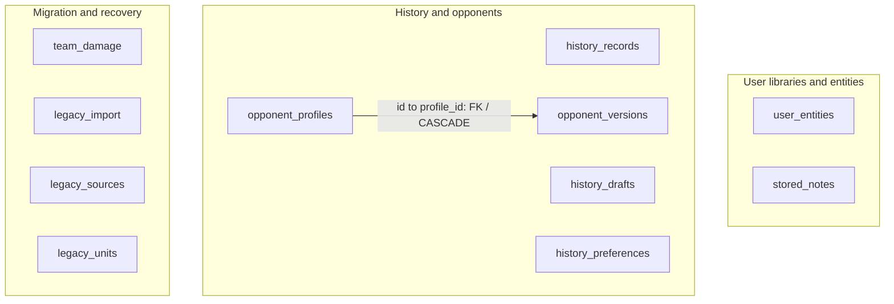
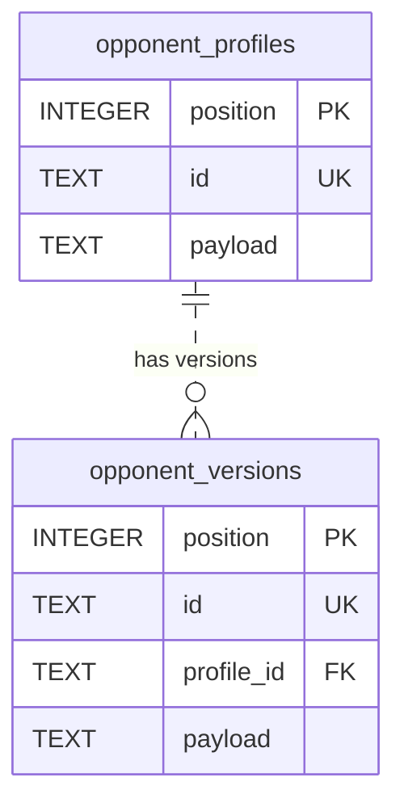
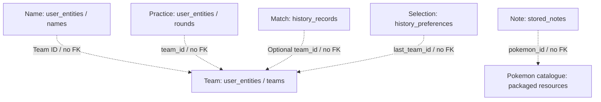

  <a href="DATABASE.md">Español</a> · <strong>English</strong>

# Database and persistence model

[← Overview](../README.en.md) · [Technical overview](TECHNICAL_OVERVIEW.en.md) · [Documentation](README.en.md)

**SQLite · Drift · Schema v2 · 11 tables · 4 explicit secondary indexes · 1 declared foreign key**

Documented from the schema and repositories reviewed on **22 September 2026**. This describes structure and behaviour; it includes no creation SQL, engine source, user records or database dump.

## What it stores—and what it does not

The database holds user-created data and migration control: teams, notes, matches, drafts, opponents and practice. Pokémon, move and ability catalogues are packaged local resources; **there are no SQL Pokémon or move tables here**. Language, appearance and audio use separate preferences.

This is a **hybrid relational/document model**: stable columns support identity, ordering and indexing, while composite content is retained as JSON and interpreted through codecs/models. A fully normalised diagram with fictional member, move and statistic tables would misrepresent the implementation.

## Complete physical map

Each box is a real table. The only edge between tables represents the declared FK; grouping boxes does not create SQL relationships.

### Declared referential relationship

Each version belongs to one profile; a profile can have zero or more versions. The FK references the profile's **unique `id`**, not its `position` PK, and declares **`ON DELETE CASCADE`**. Versions have independent identifiers; the dashed ER line denotes a non-identifying relationship, not an optional FK.

There is **no declared FK** from `history_records.team_id`, `history_preferences.last_team_id`, `user_entities.team_id` or `stored_notes.pokemon_id`. Migration tables also have no FKs between them. Their associations are coordinated by application code, not presented as SQL-engine guarantees.

## Logical product associations

This second map is **not a foreign-key diagram**. It explains how IDs and documents are interpreted.

Snapshots inside match/practice content preserve information from the recorded moment; they are not additional tables. Deleting a team does not imply an SQL cascade over match history. The packaged catalogue is outside the SQLite file.

## Table dictionary

`PK`: primary key. `UK`: uniqueness. `FK`: foreign key. `?`: nullable. Types are declared types; JSON is stored as `TEXT`.

Open the complete 11-table dictionary

### 1. stored_notes

| Field | Type and contract |
| --- | --- |
| `position` | INTEGER, autoincrement PK; storage order. |
| `id` | TEXT, UK, required and non-empty after trim. |
| `pokemon_id` | Required TEXT; catalogue association, no SQL FK. |
| `payload` | Required TEXT with `json_valid`; note content. |

### 2. history_records

| Field | Type and contract |
| --- | --- |
| `position` | INTEGER, autoincrement PK. |
| `id` | TEXT, UK, required and non-empty. |
| `team_id` | TEXT?; team selection/filtering, no FK. |
| `played_at` | Required INTEGER; the repository writes microseconds since epoch. |
| `outcome` | Required TEXT; CHECK restricted to `victory` or `defeat`. |
| `payload` | Required TEXT with `json_valid`; serialised record and snapshots. |

### 3. history_drafts

| Field | Type and contract |
| --- | --- |
| `slot` | INTEGER PK, CHECK `slot = 1`: at most one row, not required presence. |
| `revision` | TEXT?; when present it cannot be empty after trim. |
| `payload` | Required TEXT with `json_valid`; serialised draft. |

Revision is used during draft completion; the column CHECK alone does not implement concurrency control.

### 4–5. opponent_profiles and opponent_versions

Both have `position` INTEGER autoincrement PK, unique/non-empty `id` TEXT, and `payload` TEXT with `json_valid`. `opponent_versions` adds required `profile_id` TEXT, an FK to profile `id` with cascading deletion. Versions represent configurations associated with an opponent without conflating them with the user's teams.

### 6. history_preferences

`slot` INTEGER PK with CHECK `slot = 1`, and required/non-empty `last_team_id` TEXT. It remembers the history screen's team selection. This is a **zero-or-one-row table**, separate from visual app preferences.

### 7. user_entities

| Field | Type and contract |
| --- | --- |
| `position` | INTEGER, autoincrement PK; explicit ordering. |
| `scope` | Required TEXT; entity category. |
| `id` | Required TEXT; uniqueness is composite **`(scope, id)`**, not global. |
| `team_id` | TEXT?; optional association without an FK. |
| `payload` | Required TEXT with `json_valid`; composite document. |

The schema does not enforce an SQL enum for `scope`. Reviewed repositories use these eight scopes:

| Scope | Meaning |
| --- | --- |
| `teams` | Saved teams. |
| `names` | Custom team names. |
| `rounds` | Lead Trainer practice rounds. |
| `rivals` | Custom opponents in the Lead Trainer library. |
| `disabled` | Official teams disabled in that library. |
| `library_names` | Library display-name overrides. |
| `pairs` | Opening-pair configurations. |
| `library_meta` | Library/rules version metadata. |

The entity envelope distinguishes `schemaVersion` and `value`; the examined reader accepts version 1 and rejects unsupported future versions. **Document version, SQL schema version and application version are separate concepts.** The complete library has its own codec; a universal payload format is not assumed across all tables.

### 8. team_damage

`source_index` INTEGER PK and required `original`, `diagnostic`, `source` TEXT. **This does not store battle-damage calculations:** it preserves information about damaged team data detected during recovery/import. The distinction matters when interpreting the name.

### 9. legacy_import

| Field | Type and contract |
| --- | --- |
| `slot` | INTEGER PK, CHECK `slot = 1`. |
| `generation`, `manifest` | Required TEXT; preparation identity and manifest. |
| `state` | TEXT with CHECK: `preparing`, `verified`, `dirty` or `active`. |
| `revision`, `sealed_revision` | Required INTEGER, initial value 0. |
| `seal` | Required TEXT; preparation verification. |

The schema declares `manifest` as TEXT without a `json_valid` CHECK here. Its structure and provenance are validated by the storage flow.

### 10–11. legacy_sources and legacy_units

`legacy_sources` holds `source_key` TEXT PK plus required `representation` and `disposition` TEXT. `legacy_units` holds `name` TEXT PK, `record_count` INTEGER and `digest` TEXT, all required. These are provenance and verification records, **not FK-linked tables** or a complete application event log.

## Indexes and access patterns

In addition to implicit primary/unique indexes, four secondary indexes are declared:

| Index | Columns in order | Supported access |
| --- | --- | --- |
| `notes_pokemon` | `pokemon_id`, `position` | Ordered notes for a Pokémon. |
| `history_team_date` | `team_id`, `played_at DESC`, `id DESC` | Team selection and temporal ordering when requested by a query. |
| `versions_profile` | `profile_id`, `position` | Ordered versions of a profile. |
| `entities_team` | `scope`, `team_id`, `position` | Scoped/team-related entities. |

**An existing index does not mean a query is fully optimised.** The reviewed history repository reduces by team in SQL but applies other filters using canonical domain logic. The examined Lead Trainer record repository loads rounds and filters by team in application code. SQL pagination or aggregation is not claimed when it has not been observed.

## Transactions and connection ownership

Repositories share a storage owner rather than opening a connection per widget. Native opening configures **WAL**, **synchronous=FULL**, **foreign_keys=ON**, and a **5,000 ms default `busy_timeout`**. Identity, version and `quick_check` are checked before exposing a usable connection; reopening an active generation also checks foreign keys.

Admitted actions pass through a FIFO queue, and closing waits for completion. This coordinates the application's connection; it is not a claim of global serialisation against every possible external writer.

Composite saves use transactions. History draft completion brings together identity, record and successor; revision checks prevent a changed state from being treated as the original. Observed queries return Futures; using Drift does not automatically make all access use `watch()`.

## Migration and integrity

Two different processes exist:

**SQL schema migration.** The reviewed implementation declares version 2 and supports the version 1 → 2 transition. It adds entities, recovery and import control, and installs verification mechanisms. Transitions outside that contract are rejected.

**Activation from previous storage.** The coordinator preserves originals, prepares a SQLite generation, verifies its contents and only then exposes repositories. Incomplete, incompatible or provenance-inconsistent data produces a blocked state rather than silently creating an empty library.

Persisted states are `preparing`, `verified`, `dirty` and `active`. There are **30 verification triggers**: INSERT/UPDATE/DELETE on ten tables increment the `legacy_import` revision; a `verified` generation becomes `dirty` when changed. Normal writes to an `active` generation do not automatically change it to `dirty`. This protects the currency of a verified preparation; **it is not an event log, encryption or a guarantee against malicious tampering**.

## Design trade-offs

Versioned JSON preserves aggregates and snapshots without a table for every game attribute. In exchange, some semantic validation and association management rests with codecs/repositories; `json_valid` establishes JSON syntax, not competitive legality or ID consistency. Relational storage provides transactions, uniqueness and selected indexes, not exhaustive normalisation.

No claim is made of at-rest encryption, cloud synchronisation, remote recovery, complete failure coverage or quantified performance for every index. Documenting the schema does not promise a stable public API.

[Engineering decisions](ENGINEERING.en.md) · [Calculation and save flows](TECHNICAL_OVERVIEW.en.md) · [Historical validation](VALIDATION.en.md)

Diagrams use [Mermaid ER](https://mermaid.js.org/syntax/entityRelationshipDiagram) and [GitHub diagram formatting](https://docs.github.com/en/get-started/writing-on-github/working-with-advanced-formatting/creating-diagrams). The model's source is the reviewed project implementation; these references explain notation rather than certify its schema.
