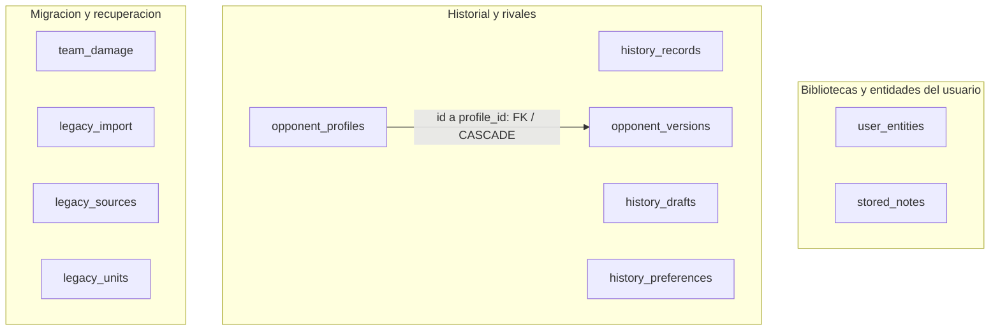
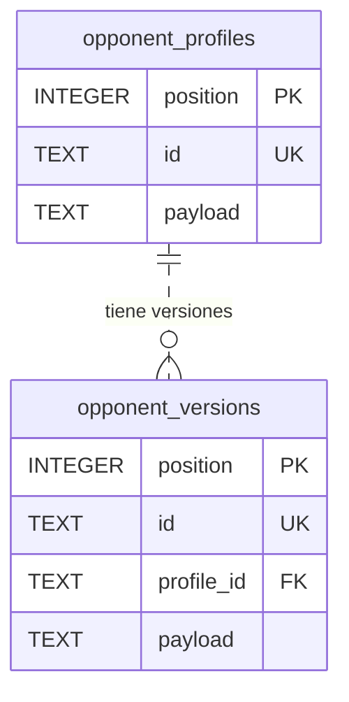
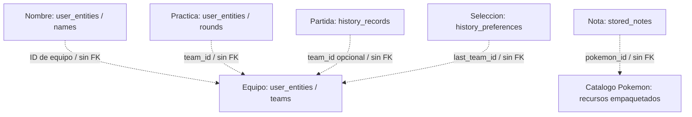

  <strong>Español</strong> · <a href="DATABASE.en.md">English</a>

# Base de datos y modelo de persistencia

[← Portada](../README.md) · [Ficha técnica](TECHNICAL_OVERVIEW.md) · [Documentación](README.md)

**SQLite · Drift · Esquema v2 · 11 tablas · 4 índices secundarios explícitos · 1 clave foránea declarada**

Modelo documentado a partir del esquema y los repositorios revisados el **22 de septiembre de 2026**. Es documentación de estructura y comportamiento: no incluye SQL de creación, código del motor, registros de usuario ni un volcado de la base de datos.

## Qué guarda y qué no guarda

La BD conserva datos creados por el usuario y el control de su migración: equipos, notas, partidas, borradores, rivales y prácticas. Los catálogos de Pokémon, movimientos y habilidades se empaquetan como recursos locales; **no existen aquí tablas SQL de Pokémon o movimientos**. Idioma, apariencia y audio usan preferencias separadas.

El diseño es **híbrido relacional/documental**: columnas estables permiten identificar, ordenar e indexar; el contenido compuesto se conserva como JSON y se interpreta mediante codecs/modelos. Por eso sería incorrecto dibujar un esquema totalmente normalizado con tablas ficticias de integrantes, movimientos y estadísticas.

## Mapa físico completo

Cada caja representa una tabla real. La única arista entre tablas representa la FK declarada; agrupar cajas no crea relaciones SQL.

### Relación referencial declarada

Cada versión pertenece a un perfil; un perfil puede tener cero o más versiones. La FK apunta al **`id` único del perfil**, no a su PK `position`, y declara **`ON DELETE CASCADE`**. El identificador de cada versión es independiente; la línea discontinua del ER expresa una relación no identificadora, no una FK opcional.

**No hay FK** declarada desde `history_records.team_id`, `history_preferences.last_team_id`, `user_entities.team_id` o `stored_notes.pokemon_id`. Tampoco hay FK entre las tablas de migración. Sus asociaciones se coordinan en la aplicación; no se presentan como garantías del motor SQL.

## Asociaciones lógicas del producto

Este segundo mapa **no es un diagrama de claves foráneas**. Explica cómo se interpretan los IDs y los documentos.

Los snapshots dentro del contenido de partidas/prácticas preservan información del momento registrado; no son nuevas tablas. El borrado de un equipo no implica una cascada SQL sobre el historial. El catálogo empaquetado no forma parte del archivo SQLite.

## Diccionario de tablas

`PK`: clave primaria. `UK`: unicidad. `FK`: clave foránea. `?`: admite NULL. Los tipos indicados son los declarados; el JSON se almacena como `TEXT`.

Abrir diccionario completo de las 11 tablas

### 1. stored_notes

| Campo | Tipo y contrato |
| --- | --- |
| `position` | INTEGER, PK autoincremental; orden de almacenamiento. |
| `id` | TEXT, UK, obligatorio y no vacío después de trim. |
| `pokemon_id` | TEXT obligatorio; asociación al catálogo, sin FK SQL. |
| `payload` | TEXT obligatorio con `json_valid`; contenido de la nota. |

### 2. history_records

| Campo | Tipo y contrato |
| --- | --- |
| `position` | INTEGER, PK autoincremental. |
| `id` | TEXT, UK, obligatorio y no vacío. |
| `team_id` | TEXT?; selección/filtrado por equipo, sin FK. |
| `played_at` | INTEGER obligatorio; el repositorio escribe microsegundos desde época. |
| `outcome` | TEXT obligatorio; CHECK restringido a `victory` o `defeat`. |
| `payload` | TEXT obligatorio con `json_valid`; registro y snapshots serializados. |

### 3. history_drafts

| Campo | Tipo y contrato |
| --- | --- |
| `slot` | INTEGER, PK y CHECK `slot = 1`: como máximo una fila, no presencia obligatoria. |
| `revision` | TEXT?; si existe no puede estar vacío después de trim. |
| `payload` | TEXT obligatorio con `json_valid`; borrador serializado. |

La revisión se usa al finalizar un borrador; el mero CHECK de columna no implementa por sí solo el control de concurrencia.

### 4–5. opponent_profiles y opponent_versions

Ambas tienen `position` INTEGER PK autoincremental, `id` TEXT único/no vacío y `payload` TEXT con `json_valid`. `opponent_versions` añade `profile_id` TEXT obligatorio, FK al `id` del perfil con cascada de borrado. Las versiones permiten representar configuraciones asociadas a un rival sin confundirlas con equipos propios.

### 6. history_preferences

`slot` INTEGER PK con CHECK `slot = 1` y `last_team_id` TEXT obligatorio/no vacío. Conserva la última selección de equipo del historial. Es una tabla de **cero o una fila**, separada de las preferencias visuales de la app.

### 7. user_entities

| Campo | Tipo y contrato |
| --- | --- |
| `position` | INTEGER, PK autoincremental; conserva orden explícito. |
| `scope` | TEXT obligatorio; clasifica el tipo de entidad. |
| `id` | TEXT obligatorio; la unicidad es conjunta **`(scope, id)`**, no global. |
| `team_id` | TEXT?; asociación opcional sin FK. |
| `payload` | TEXT obligatorio con `json_valid`; documento compuesto. |

El esquema no impone un enum SQL a `scope`. Los repositorios revisados usan estos ocho ámbitos:

| Ámbito | Significado |
| --- | --- |
| `teams` | Equipos guardados. |
| `names` | Nombres personalizados de equipos. |
| `rounds` | Rondas de práctica de Entradas. |
| `rivals` | Rivales personalizados de la biblioteca de Entradas. |
| `disabled` | Equipos oficiales deshabilitados en esa biblioteca. |
| `library_names` | Nombres alternativos de la biblioteca. |
| `pairs` | Configuraciones de parejas iniciales. |
| `library_meta` | Metadatos de versiones de biblioteca/reglas. |

El contenedor de estas entidades distingue `schemaVersion` y `value`; el lector examinado admite versión 1 y rechaza versiones futuras no soportadas. **Versión del documento, versión SQL y versión de la app son tres cosas diferentes.** La biblioteca completa usa su propio codec; no se asume un único formato de payload para todas las tablas.

### 8. team_damage

`source_index` INTEGER PK y `original`, `diagnostic`, `source` TEXT obligatorios. **No contiene cálculos de daño de combate:** conserva información de equipos dañados detectados durante la recuperación/importación. Esa distinción evita interpretar mal el nombre.

### 9. legacy_import

| Campo | Tipo y contrato |
| --- | --- |
| `slot` | INTEGER PK, CHECK `slot = 1`. |
| `generation`, `manifest` | TEXT obligatorios; identidad de preparación y manifiesto. |
| `state` | TEXT con CHECK: `preparing`, `verified`, `dirty` o `active`. |
| `revision`, `sealed_revision` | INTEGER obligatorios, valor inicial 0. |
| `seal` | TEXT obligatorio; verificación de la preparación. |

El esquema declara `manifest` como TEXT; no añade aquí un CHECK `json_valid`. Validar la estructura y procedencia de ese contenido corresponde al flujo de almacenamiento.

### 10–11. legacy_sources y legacy_units

`legacy_sources` conserva `source_key` TEXT PK, `representation` y `disposition` TEXT obligatorios. `legacy_units` conserva `name` TEXT PK, `record_count` INTEGER y `digest` TEXT obligatorios. Son registros de origen y verificación, **no tablas vinculadas por FK** ni un historial completo de eventos de la app.

## Índices y acceso

Además de los índices implícitos de PK/unicidad, se declaran cuatro índices secundarios:

| Índice | Columnas, en orden | Acceso que apoya |
| --- | --- | --- |
| `notes_pokemon` | `pokemon_id`, `position` | Notas de un Pokémon en orden. |
| `history_team_date` | `team_id`, `played_at DESC`, `id DESC` | Selección por equipo y orden temporal cuando la consulta lo solicita. |
| `versions_profile` | `profile_id`, `position` | Versiones de un perfil en orden. |
| `entities_team` | `scope`, `team_id`, `position` | Entidades por ámbito/equipo. |

**Índice existente no equivale a consulta plenamente optimizada.** El repositorio de historial revisado reduce por equipo en SQL, pero aplica otros filtros mediante la lógica canónica de dominio. El registro de Entradas leído carga sus rondas y filtra por equipo en la aplicación. No se atribuye al SQL una paginación o agregación que no se ha observado.

## Transacciones y propiedad de la conexión

Los repositorios comparten un propietario de almacenamiento; no abren una conexión por widget. La apertura nativa configura **WAL**, **synchronous=FULL**, **foreign_keys=ON** y un `busy_timeout` de **5.000 ms por defecto**. Se comprueban identidad, versión y `quick_check` antes de exponer una conexión utilizable; al reabrir una generación activa también se revisan las FK.

Las acciones admitidas pasan por una cola FIFO; el cierre espera su finalización. Es coordinación de la conexión de la aplicación, no una afirmación de serialización global frente a cualquier escritor externo.

Los guardados compuestos usan transacciones. En el historial, finalizar un borrador reúne identidad, registro y sucesor; las comprobaciones de revisión evitan tratar un estado cambiado como si fuera el original. Las consultas observadas usan Futures; el uso de Drift no convierte automáticamente todo el acceso en `watch()`.

## Migración e integridad

Hay dos procesos diferentes:

**Migración de esquema SQL.** La implementación revisada declara versión 2 y admite la transición de versión 1 a 2. Añade entidades, recuperación y control de importación e instala los mecanismos de verificación. Transiciones fuera de ese contrato se rechazan.

**Activación desde almacenamiento anterior.** El coordinador conserva originales, prepara una generación SQLite, verifica su contenido y solo entonces publica los repositorios. Datos incompletos, incompatibles o de procedencia inconsistente producen un estado bloqueado, no la creación silenciosa de una biblioteca vacía.

Los estados persistidos son `preparing`, `verified`, `dirty` y `active`. Hay **30 triggers de verificación**: INSERT/UPDATE/DELETE sobre diez tablas incrementan la revisión de `legacy_import`; una generación `verified` pasa a `dirty` si cambia. Las escrituras normales sobre una generación `active` no la convierten automáticamente en `dirty`. Esto protege la vigencia de una preparación verificada; **no es un event log, un sistema de cifrado ni una garantía contra manipulación maliciosa**.

## Compromisos del diseño

El JSON versionado permite conservar agregados y snapshots sin una tabla por cada atributo de juego. A cambio, parte de la validación semántica y de las asociaciones recae en codecs/repositorios; `json_valid` solo prueba sintaxis JSON, no legalidad competitiva ni coherencia de IDs. El componente relacional proporciona transacciones, unicidad e índices seleccionados, no normalización exhaustiva.

No se afirma cifrado en reposo, sincronización cloud, recuperación remota, cobertura de fallos completa ni rendimiento cuantificado de cada índice. La descripción del esquema no es una promesa de estabilidad de una API pública.

[Decisiones de ingeniería](ENGINEERING.md) · [Flujos de cálculo y guardado](TECHNICAL_OVERVIEW.md) · [Validación histórica](VALIDATION.md)

Los diagramas usan [Mermaid ER](https://mermaid.js.org/syntax/entityRelationshipDiagram) y el [formato de diagramas de GitHub](https://docs.github.com/es/get-started/writing-on-github/working-with-advanced-formatting/creating-diagrams). La fuente del modelo es la implementación revisada del proyecto; esas referencias explican la notación, no certifican su esquema.
