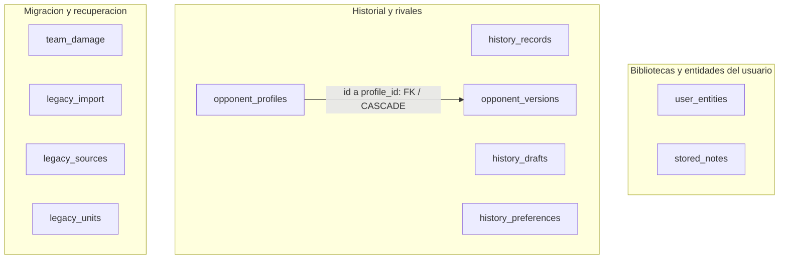
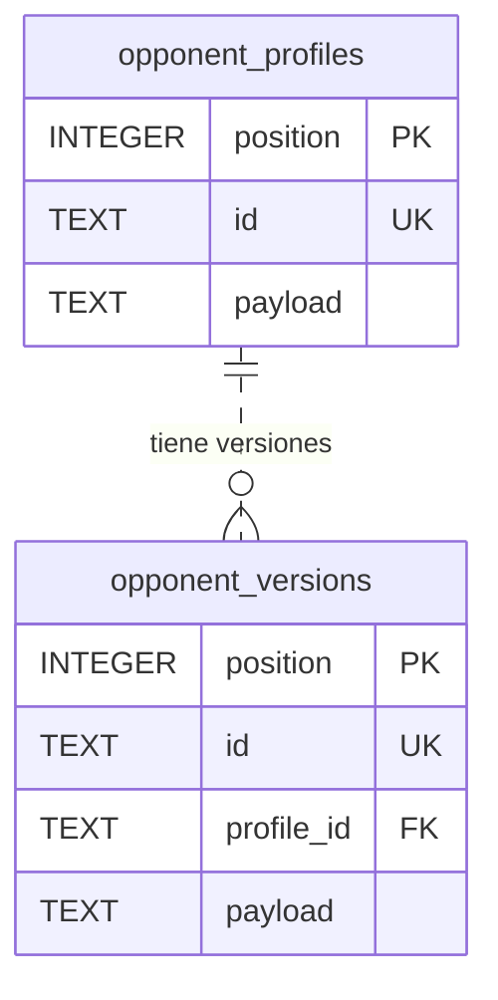
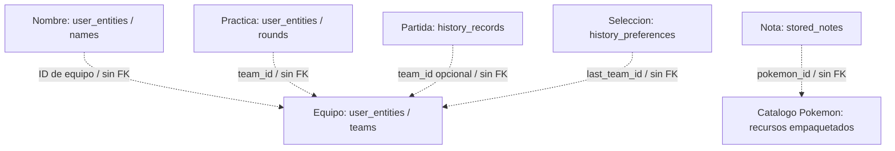

  <strong>Español</strong> · <a href="DATABASE.en.md">English</a>

# Base de datos y modelo de persistencia

[← Portada](../README.md) · [Ficha técnica](TECHNICAL_OVERVIEW.md) · [Documentación](README.md)

**SQLite · Drift · Esquema v2 · 11 tablas · 4 índices secundarios explícitos · 1 clave foránea declarada**

## Organización de los datos

SQLite conserva los equipos, notas, partidas, borradores, rivales y prácticas del usuario, junto con el control de migración. Los catálogos de Pokémon, movimientos y habilidades son recursos empaquetados fuera de la base de datos. Idioma, apariencia y audio utilizan preferencias separadas.

El modelo combina columnas relacionales para identificar, ordenar e indexar registros con documentos JSON para su contenido compuesto. Los codecs interpretan esos documentos y validan los modelos de la aplicación. Los integrantes, movimientos y estadísticas de un equipo forman parte de su contenido, en lugar de ocupar tablas independientes.

## Mapa físico completo

Las cajas representan tablas. La flecha indica la clave foránea declarada entre perfiles y versiones de rivales.

### Relación referencial declarada

Cada versión pertenece a un perfil; un perfil puede tener cero o más versiones. La FK apunta al **`id` único del perfil**, no a su PK `position`, y declara **`ON DELETE CASCADE`**. La línea discontinua del ER representa una relación no identificadora: cada versión conserva su propia identidad.

`history_records.team_id`, `history_preferences.last_team_id`, `user_entities.team_id` y `stored_notes.pokemon_id` son asociaciones gestionadas por la aplicación, sin FK declarada. Las tablas de migración tampoco tienen relaciones FK entre sí.

## Asociaciones lógicas del producto

Este mapa muestra las referencias por ID, diferenciadas de la integridad referencial SQL.

Los snapshots de partidas y prácticas conservan información del momento registrado dentro del documento JSON. El borrado de un equipo no implica una cascada SQL sobre su historial. Las notas utilizan un ID del catálogo empaquetado, que está fuera del archivo SQLite.

## Diccionario de tablas

`PK`: clave primaria. `UK`: unicidad. `FK`: clave foránea. `?`: admite NULL. El JSON se almacena como `TEXT`.

Abrir diccionario completo de las 11 tablas

### 1. stored_notes

| Campo | Tipo y contrato |
| --- | --- |
| `position` | INTEGER, PK autoincremental; orden de almacenamiento. |
| `id` | TEXT, UK, obligatorio y no vacío después de trim. |
| `pokemon_id` | TEXT obligatorio; asociación al catálogo, sin FK SQL. |
| `payload` | TEXT obligatorio con `json_valid`; contenido de la nota. |

### 2. history_records

| Campo | Tipo y contrato |
| --- | --- |
| `position` | INTEGER, PK autoincremental. |
| `id` | TEXT, UK, obligatorio y no vacío después de trim. |
| `team_id` | TEXT?; selección y filtrado por equipo, sin FK. |
| `played_at` | INTEGER obligatorio; el repositorio escribe microsegundos desde época. |
| `outcome` | TEXT obligatorio; CHECK restringido a `victory` o `defeat`. |
| `payload` | TEXT obligatorio con `json_valid`; registro y snapshots serializados. |

### 3. history_drafts

| Campo | Tipo y contrato |
| --- | --- |
| `slot` | INTEGER, PK y CHECK `slot = 1`: como máximo una fila. |
| `revision` | TEXT?; si existe no puede estar vacío después de trim. |
| `payload` | TEXT obligatorio con `json_valid`; borrador serializado. |

El repositorio comprueba la revisión al finalizar un borrador. El CHECK de columna valida su formato; el control de concurrencia se realiza dentro de la operación.

### 4–5. opponent_profiles y opponent_versions

Ambas tablas tienen `position` INTEGER PK autoincremental, `id` TEXT único y no vacío después de trim, y `payload` TEXT obligatorio con `json_valid`.

`opponent_versions` añade `profile_id` TEXT obligatorio, FK al `id` del perfil con cascada de borrado. Las versiones permiten conservar configuraciones asociadas a un rival por separado de los equipos propios.

### 6. history_preferences

`slot` INTEGER PK con CHECK `slot = 1` y `last_team_id` TEXT obligatorio y no vacío después de trim. Guarda la última selección de equipo de HISTÓRICO. La tabla admite cero o una fila y es independiente de las preferencias visuales.

### 7. user_entities

| Campo | Tipo y contrato |
| --- | --- |
| `position` | INTEGER, PK autoincremental; conserva orden explícito. |
| `scope` | TEXT obligatorio; clasifica el tipo de entidad. |
| `id` | TEXT obligatorio; unicidad conjunta **`(scope, id)`**. |
| `team_id` | TEXT?; asociación opcional sin FK. |
| `payload` | TEXT obligatorio con `json_valid`; documento compuesto. |

Los repositorios utilizan ocho ámbitos. `scope` es un campo de texto, sin enum impuesto por SQL.

| Ámbito | Contenido |
| --- | --- |
| `teams` | Equipos guardados. |
| `names` | Nombres personalizados de equipos. |
| `rounds` | Rondas de práctica de Entradas. |
| `rivals` | Rivales personalizados de la biblioteca de Entradas. |
| `disabled` | Equipos oficiales deshabilitados en esa biblioteca. |
| `library_names` | Nombres alternativos de la biblioteca. |
| `pairs` | Configuraciones de parejas iniciales. |
| `library_meta` | Metadatos de versiones de biblioteca y reglas. |

El contenedor de entidades distingue `schemaVersion` y `value`. Su lector admite versión 1 y rechaza versiones futuras no soportadas. La versión del documento, el esquema SQL y la aplicación se gestionan por separado. La biblioteca completa utiliza su propio codec; cada tabla conserva el formato de contenido que le corresponde.

### 8. team_damage

`source_index` INTEGER PK y `original`, `diagnostic`, `source` TEXT obligatorios. Conserva información de equipos dañados durante la recuperación o importación, no cálculos de daño de combate.

### 9. legacy_import

| Campo | Tipo y contrato |
| --- | --- |
| `slot` | INTEGER PK, CHECK `slot = 1`. |
| `generation`, `manifest` | TEXT obligatorios; identidad de preparación y manifiesto. |
| `state` | TEXT con CHECK: `preparing`, `verified`, `dirty` o `active`. |
| `revision`, `sealed_revision` | INTEGER obligatorios, valor inicial 0. |
| `seal` | TEXT obligatorio; verificación de la preparación. |

`manifest` es TEXT sin CHECK `json_valid`. La estructura y procedencia de su contenido se validan en el flujo de almacenamiento.

### 10–11. legacy_sources y legacy_units

`legacy_sources` contiene `source_key` TEXT PK, `representation` y `disposition` TEXT obligatorios.

`legacy_units` contiene `name` TEXT PK, `record_count` INTEGER y `digest` TEXT obligatorios.

Estas tablas registran el origen de los datos y los resultados de verificación. Se coordinan desde la aplicación, sin FK entre ellas.

## Índices y acceso

Además de los índices implícitos de PK y unicidad, el esquema declara cuatro índices secundarios:

| Índice | Columnas, en orden | Acceso que apoya |
| --- | --- | --- |
| `notes_pokemon` | `pokemon_id`, `position` | Notas de un Pokémon en orden. |
| `history_team_date` | `team_id`, `played_at DESC`, `id DESC` | Selección por equipo y orden temporal. |
| `versions_profile` | `profile_id`, `position` | Versiones de un perfil en orden. |
| `entities_team` | `scope`, `team_id`, `position` | Entidades por ámbito y equipo. |

HISTÓRICO reduce por equipo en SQL y aplica otros filtros mediante la lógica de dominio. El registro de Entradas carga sus rondas y filtra por equipo en la aplicación. El aprovechamiento de cada índice depende de la consulta; su existencia por sí sola no determina el rendimiento.

## Transacciones y propiedad de la conexión

Los repositorios comparten un propietario de almacenamiento. La apertura nativa configura **WAL**, **synchronous=FULL**, **foreign_keys=ON** y un **`busy_timeout` de 5.000 ms por defecto**. Se comprueban identidad, versión y `quick_check` antes de exponer la conexión; al reabrir una generación activa también se revisan las FK.

Las operaciones admitidas pasan por una cola FIFO. El cierre espera a que finalicen y rechaza las nuevas. Esta coordinación pertenece a la conexión de la aplicación, mientras que SQLite gestiona sus bloqueos frente a otras conexiones.

Los guardados compuestos utilizan transacciones. Finalizar un borrador de HISTÓRICO reúne identidad, registro y sucesor, con comprobación de la revisión esperada. Los repositorios documentados devuelven Futures; la interfaz se actualiza desde sus controladores.

## Migración e integridad

La **migración de esquema SQL** admite la transición de versión 1 a 2. Añade las tablas de entidades, recuperación y control de importación e instala los mecanismos de verificación. Se rechazan transiciones fuera de ese contrato.

La **activación del almacenamiento** conserva los originales, prepara una generación SQLite, verifica su contenido y publica los repositorios cuando está lista. Un estado incompleto, incompatible o de procedencia inconsistente bloquea la activación en lugar de iniciar una biblioteca vacía.

Los estados persistidos son `preparing`, `verified`, `dirty` y `active`. **Treinta triggers de verificación** cubren INSERT, UPDATE y DELETE en diez tablas: incrementan la revisión de `legacy_import` y cambian una generación `verified` a `dirty` si se modifica. Las escrituras normales de una generación `active` conservan ese estado.

Estos controles comprueban la vigencia de la preparación. Son distintos de un registro completo de eventos o de un mecanismo de cifrado.

## Compromisos del diseño

El JSON versionado permite conservar equipos y snapshots con estructuras compuestas. Los codecs y repositorios validan su significado y coordinan las asociaciones sin FK. `json_valid` comprueba sintaxis JSON, no legalidad competitiva ni coherencia entre IDs.

Las columnas relacionales aportan transacciones, unicidad e índices para los accesos seleccionados. Los filtros que permanecen en la aplicación mantienen la lógica canónica de fechas, nombres y orden.

[Decisiones de ingeniería](ENGINEERING.md) · [Flujos de cálculo y guardado](TECHNICAL_OVERVIEW.md) · [Validación](VALIDATION.md)

Referencia del esquema: 22/09/2026. Notación: [Mermaid ER](https://mermaid.js.org/syntax/entityRelationshipDiagram) · [Diagramas en GitHub](https://docs.github.com/es/get-started/writing-on-github/working-with-advanced-formatting/creating-diagrams).
