

  <a href="GALLERY.md">Español</a> · <strong>English</strong>

# PokeChampions Core · Gallery

[← Overview](../README.en.md) · [Documentation](README.en.md)

**Visual refresh · 22 September 2026.** Six new demos and 16 new screenshots extracted from the owner’s recordings. Only earlier 1HITKO material is retained at the end and explicitly labelled. Total: **17 screenshots and seven GIF/MP4 demos, 31 media files**.

[Versus](#versus) · [EV Lab](#ev-lab) · [Teams](#teams-and-builds) · [Lead Trainer](#lead-trainer) · [History](#battle-history) · [Languages](#languages-and-appearance) · [Earlier material](#retained-earlier-material)

New MP4 exports are **720 × 1440**; GIF previews are **360 × 720**. Open a screenshot to enlarge it. Demos show the Spanish interface except for the language walkthrough; changing this document’s language does not translate recorded pixels.

## Versus

Select the attacker and Flare Blitz, calculate, then inspect damage, KO and factors. The result still comes from the same excerpt as the new demo.

**[MP4 · 12.6 s · 720 × 1440](../media/demos/versus.mp4)**

Show GIF demo

Show screenshots

  <a href="../media/screenshots/versus-matchup.png">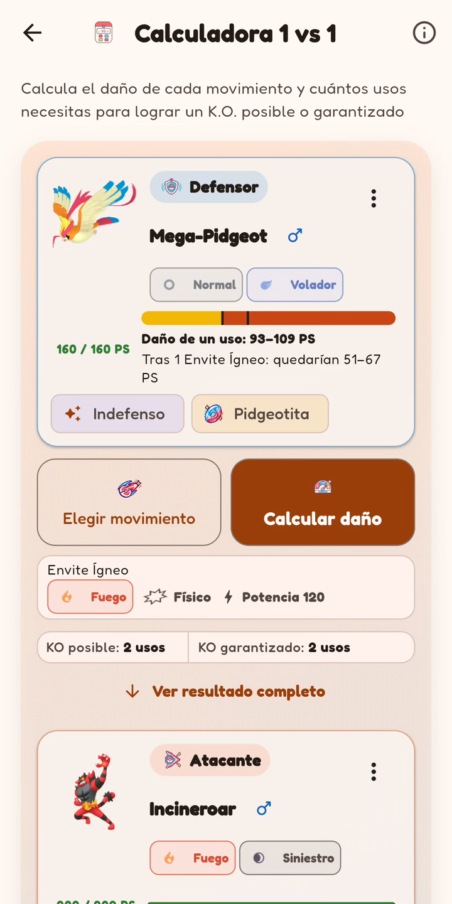</a>
  
  <a href="../media/screenshots/master-mode.png">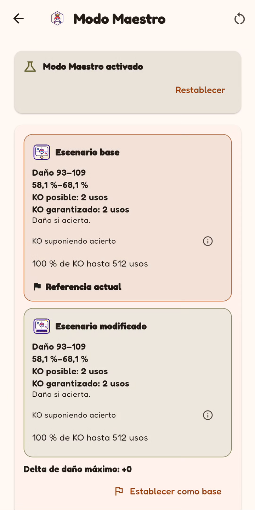</a>

## EV Lab

Explore defensive investment and run the survival search. The original interaction and displayed response are preserved; this is not a general engine test.

**[MP4 · 16.8 s · 720 × 1440](../media/demos/ev-lab.mp4)**

Show GIF demo

<a href="../media/demos/ev-lab.gif">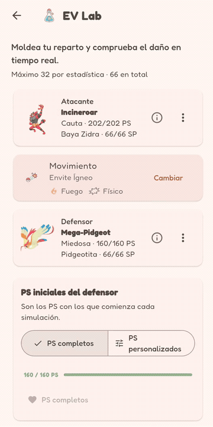</a>

Show screenshots

  

## Teams and builds

Inspect a recommended build, choose its spread and moves, apply it to Mega Charizard X and review stats. Additional stills show team composition and defensive coverage.

**[MP4 · 21.0 s · 720 × 1440](../media/demos/team-builder.mp4)**

Show GIF demo

<a href="../media/demos/team-builder.gif">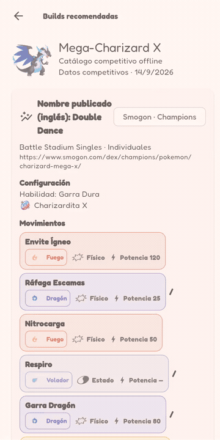</a>

Show screenshots

  
  <a href="../media/screenshots/team-coverage.png">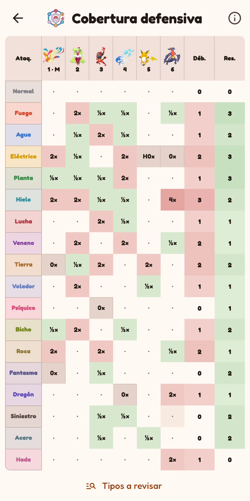</a>
  <a href="../media/screenshots/recommended-builds.png">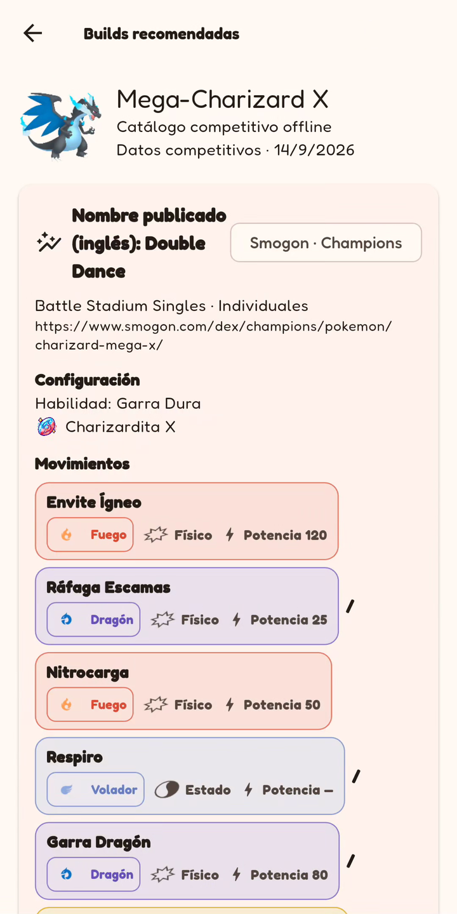</a>

## Lead Trainer

Choose an opening pair, reveal the opposing opening and manually mark a practice win. The Records still belongs to Lead Trainer, not the Battle History module.

**[MP4 · 10.0 s · 720 × 1440](../media/demos/entradas.mp4)**

Show GIF demo

Show screenshots

  
  
  

## Battle History

Manually save a match, view the summary and open the saved opponent. Match-list and analysis stills were taken before that save: they show three matches, while the later summary shows four.

**[MP4 · 9.2 s · 720 × 1440](../media/demos/history.mp4)**

Show GIF demo

<a href="../media/demos/history.gif">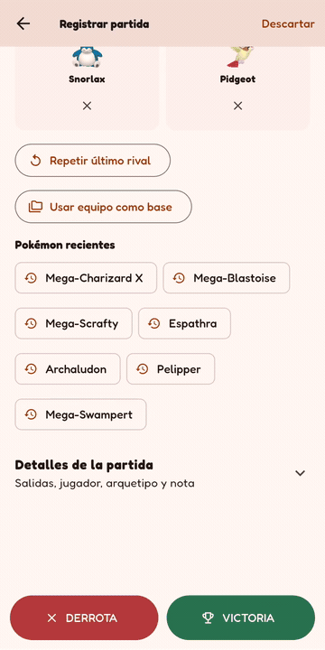</a>

Show screenshots

  <a href="../media/screenshots/history-summary.png">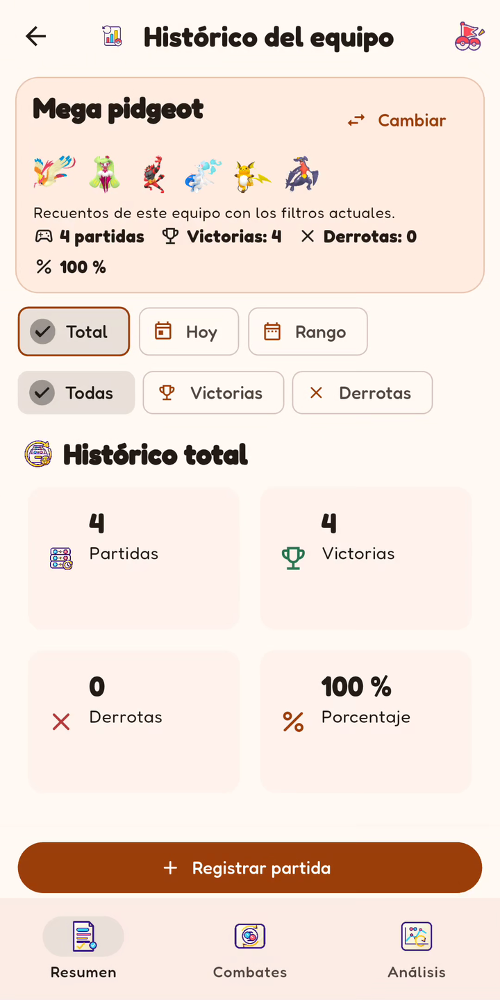</a>
  <a href="../media/screenshots/history-matches.png">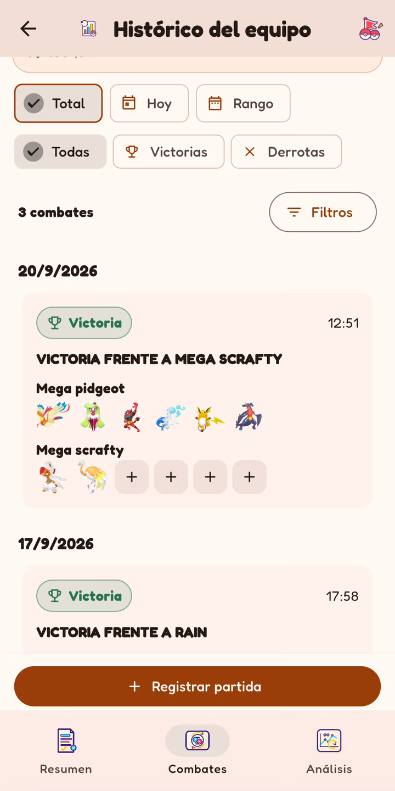</a>
  <a href="../media/screenshots/history-analysis.png">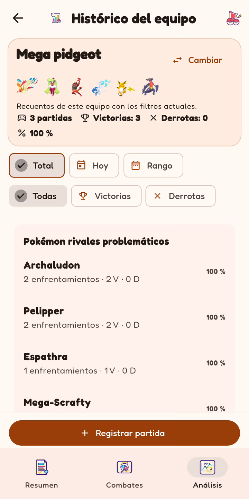</a>

## Languages and appearance

A real switch from Spanish to English and German, including the translated interface. This demo uses the dark theme; the other new demos use the light theme. The application declares eight languages, but this clip does not demonstrate all eight.

**[MP4 · 13.9 s · 720 × 1440](../media/demos/languages.mp4)**

Show GIF demo

<a href="../media/demos/languages.gif">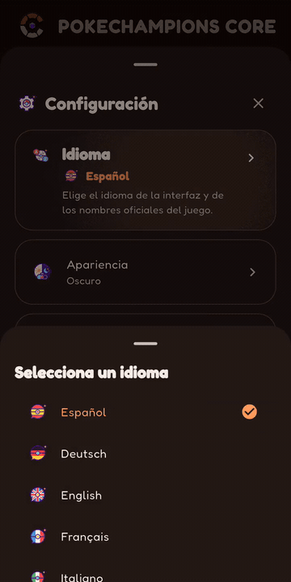</a>

Show screenshots

  
  <a href="../media/screenshots/home-dark.png">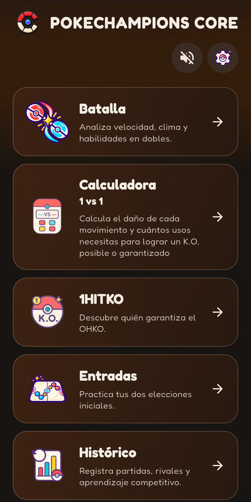</a>
  <a href="../media/screenshots/languages.png">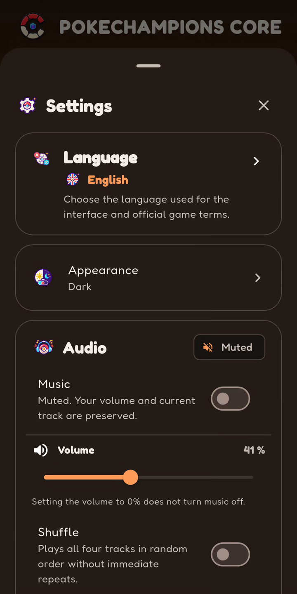</a>

## Retained earlier material

These three 1HITKO files belong to the **17 September 2026** package, not the six refresh recordings. They are retained unchanged at the owner’s request; all other earlier media is replaced or removed. They do not establish the appearance or behaviour of the latest version.

### 1HITKO

**[MP4 · ~13 s · 540 × 1080](../media/demos/1hitko.mp4)**

Show earlier demo and still

  
  

## Scope and editing

Only Android system bars are cropped; audio is removed and files are resized proportionally. Clips are continuous excerpts at the original speed with a final-frame hold: internal waiting time is not hidden and searches are not accelerated. No UI is generated, no fictional screens are assembled and no results are changed.

Practice and match outcomes are manually entered demonstrations, not evidence of competitive statistics. Battle does not execute complete matches. This material is not a benchmark, a new QA campaign or a correctness certification. The exact build has not been independently established.

[Provenance and editing](../media/README.en.md) · [SHA-256](../media/manifest.json) · [Ownership](../NOTICE.en.md)

[← Back to the overview](../README.en.md)
