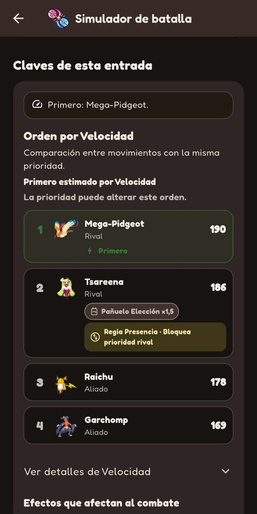
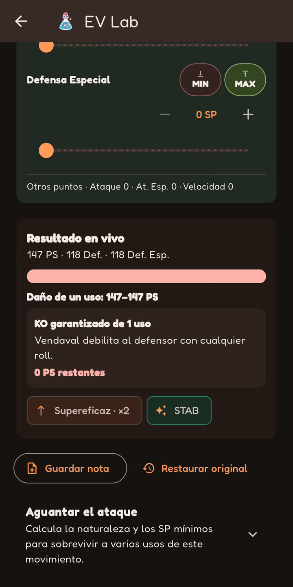
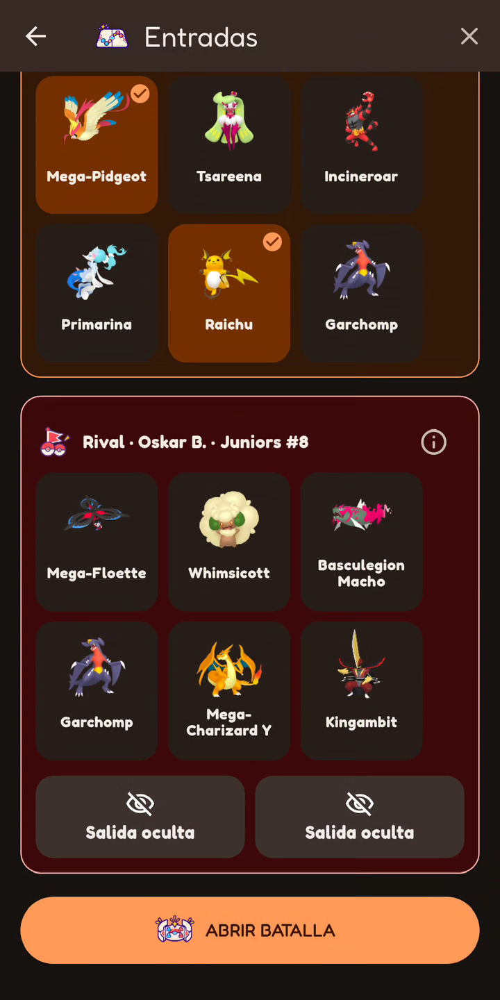
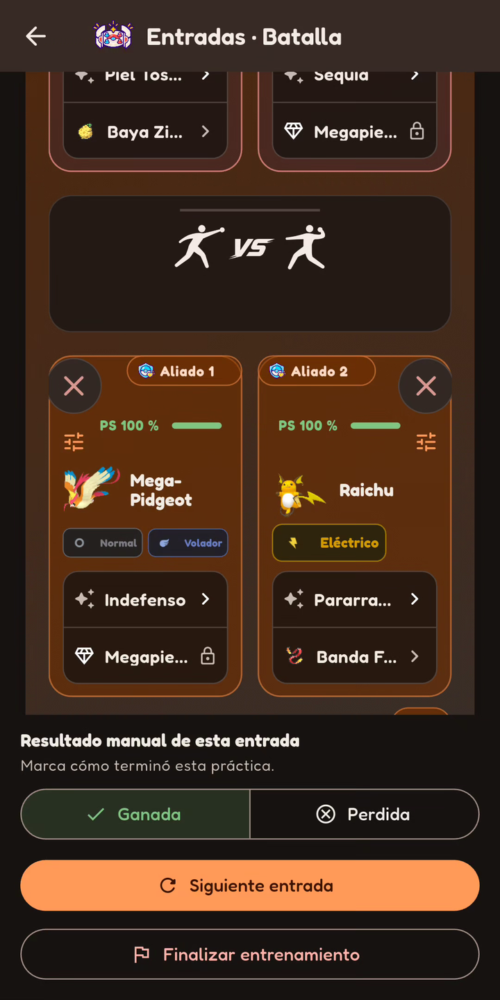
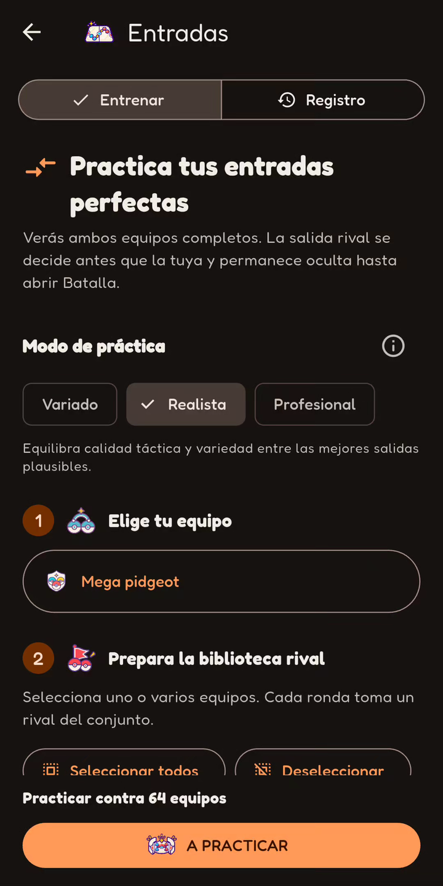

  <a href="GALLERY.md">Español</a> · <strong>English</strong>

# PokeChampions Core · Gallery

[← Back to the overview](../README.en.md)

Eight real Android screenshots and three short demos. The captured interface is **in Spanish and uses the dark theme**. Select a screenshot to enlarge it; MP4 links provide higher-resolution demos.

[Versus](#versus) · [1HITKO](#1hitko) · [Lead Trainer](#lead-trainer) · [Screenshots](#screenshots)

## Demos

### Versus

Select a move, calculate and inspect damage and KO. **[MP4 · ~13 s · 540 × 1080](../media/demos/versus.mp4)**

Show GIF preview · Versus

### 1HITKO

Configure the defender, follow search progress and inspect candidates. **[MP4 · ~13 s · 540 × 1080](../media/demos/1hitko.mp4)**

Show GIF preview · 1HITKO

### Lead Trainer

Choose an opening pair, open Battle and enter the outcome manually. **[MP4 · ~15 s · 540 × 1080](../media/demos/entradas.mp4)**

Show GIF preview · Lead Trainer

## Screenshots

Images keep their original proportions and use a consistent display width. They wrap onto new lines as space becomes narrower.

### Home · Versus · result

  
  

### 1HITKO · results · Battle · speed

  
  

### EV Lab · Lead Trainer · selection

  
  

### Lead Trainer · manual outcome · Lead Trainer · records

  
  

## Scope of this material

These images show navigation, configuration, results and practice records. There are no screenshots of Team Builder or the separate Battle History module. The visible practice record belongs to Lead Trainer; outcomes are entered manually. Battle represents a situation, not an autonomously resolved match.

The Versus still and demo show different moves. KO results apply to the displayed scenario; a 1HITKO damage guarantee does not guarantee move accuracy. This material is **not a new QA campaign, a benchmark or certification of engine correctness**.

Demos use continuous excerpts at the original recording speed, with a short final-frame hold. Android system bars were cropped, audio removed and files resized proportionally. No UI was generated and no results or warnings were altered. Full original recordings are not published.

[Provenance and editing](../media/README.md#english) · [Inventory and SHA-256](../media/manifest.json) · [Ownership and fan-project notice](../NOTICE.md)

[← Back to the overview](../README.en.md)