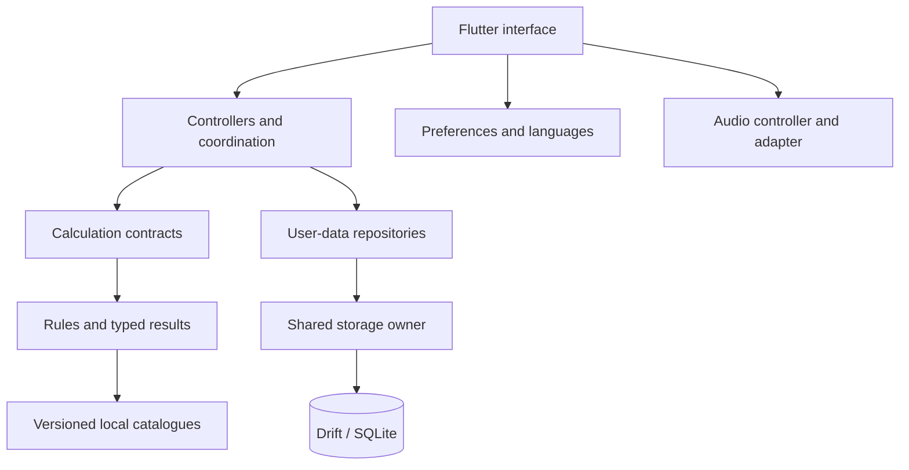
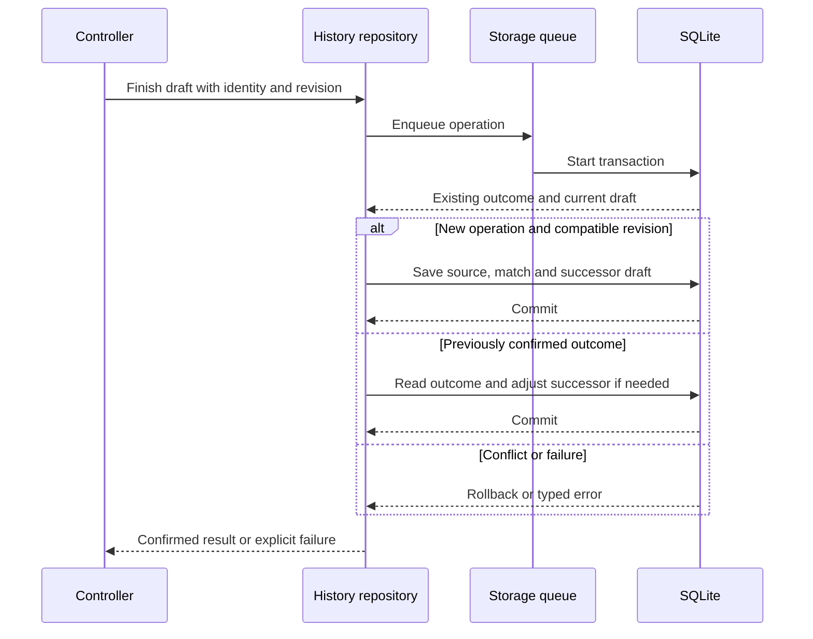

  <a href="TECHNICAL_OVERVIEW.md">Español</a> · <strong>English</strong>

# Technical overview and execution flow

[← Overview](../README.en.md) · [Documentation](README.en.md) · [Data model](DATABASE.en.md)

## System profile

PokeChampions Core is a Flutter application for competitive preparation and analysis. Calculations use local rules and catalogues; teams, notes and matches are saved through SQLite repositories. Its architecture combines feature modules, shared services and typed contracts.

## Technology inventory

| Layer | Technology | Purpose |
| --- | --- | --- |
| Interface | Flutter, Material, Dart SDK `^3.12.2` | Reusable screens and components, typed models and themes. |
| Composition | Constructors, contracts, controllers and `InheritedWidget` | Supply repositories and services and share their lifecycle. |
| Persistence | `drift 2.34.4`, `sqlite3 3.5.2` | Generated SQL access, schema v2, transactions and native isolate execution. |
| Directories | `path_provider 2.1.6` | Locate application-private directories. |
| Preferences | `shared_preferences ^2.5.5` | Language, appearance and playback settings. |
| Localisation | `flutter_localizations`, `intl ^0.20.2`, ARB and language JSON | Interface text and ID-based game terminology in eight languages. |
| Audio | `just_audio ^0.10.6`, `audio_session ^0.2.4` | Local playback and session coordination through adapters. |
| Generation | `drift_dev 2.34.0`, `build_runner 2.15.1` | Generate data-access code during development. |
| Integrity | `crypto 3.0.7`, SHA-256 and versioned artefacts | Input checks and data traceability. |
| Quality | `flutter_test`, `test ^1.31.0`, `analyzer ^12.1.0`, `flutter_lints ^6.0.0` | Logic and interface tests and static analysis. |
| Delivery | Git and Flutter/Android tooling | Versioning, builds, profiling and on-device QA. |

Versions declared in the dependency manifest of 22 September 2026. `^` denotes a compatible range; resolved versions and build parameters belong to each release.

## Responsibility map

Controllers coordinate screen operations. Contracts separate calculation and persistence from their consumers, while composition supplies concrete implementations. [Architecture](ARCHITECTURE.en.md).

## Resolving a calculation

The user configures participants, move and conditions. A controller builds a typed request and passes it to the calculation service. In Versus, this boundary is a port that allows the concrete facade to be replaced.

The evaluator applies rules and reads local catalogues. It returns damage ranges, KO conditions or the limits of the supported scenario. The interface displays the response in the selected language; translations do not determine mechanics.

Normal Versus, Master Mode, EV Lab and 1HITKO share mechanical components, with distinct flows for evaluating attacks, comparing scenarios, finding defensive investment and searching candidates.

## Saving a match

Battle History completes each draft by checking its identity and expected revision. Before writing, it checks whether the outcome already exists and whether the draft remains compatible with the requested operation.

The record and successor draft are coordinated in one transaction. Repeating a confirmed operation returns the existing result rather than creating a duplicate. A write failure triggers rollback; only an earlier confirmation can be returned with pending cleanup.

## Concurrency and state

**Storage.** A shared owner opens the connection and orders operations in FIFO sequence. Each queued action covers decoding and its transaction where applicable. A failure completes its own operation without interrupting the queue; closing waits for admitted operations.

**SQL execution.** The native connection opens on a Drift isolate. Repository access retains queue coordination and shared connection ownership.

**Search.** 1HITKO uses a worker with progress and cancellation. It checks whether a job remains current before publishing a result, preventing a superseded request from updating the screen.

**Interface.** Controllers use `ChangeNotifier`, `Future` and `Stream` according to responsibility. The documented SQL repositories read with `get()` and return Futures; controllers coordinate interface updates. This differs from an SQL subscription through `watch()`.

## Three storage groups

| Group | Contents | Storage |
| --- | --- | --- |
| **User data** | Teams, notes, matches, drafts, opponents and practice. | SQLite through shared repositories. |
| **Interface preferences** | Language, theme and audio playback. | Local preferences. |
| **Game data** | Versioned catalogues and terminology. | Resources packaged with the application. |

Battle History's last team selection is stored in `history_preferences` within SQLite. Language, theme and audio settings are managed separately.

The database combines queryable columns and JSON documents: **11 tables, four explicit secondary indexes and one declared foreign key**. Its documentation covers both SQL relationships and application-managed associations. [Diagrams and dictionary](DATABASE.en.md).

## Connections between tools

| Tool | Input and result | Data used |
| --- | --- | --- |
| Teams | Member configuration and team saving. | Scoped entities reusable for analysis. |
| Versus and Master Mode | Battle scenario, damage and comparison. | Local rules and catalogues. |
| EV Lab | Attack and defender, investment and survival options. | Shared calculation components. |
| 1HITKO | Defender and conditions, candidate search. | Legal catalogue and scenario transfer to Versus. |
| Battle | Doubles situation, speed order and context. | Participants and field conditions. |
| Lead Trainer | Opening choice, practice and manual outcome. | Opponent library and round records. |
| Battle History | Declared outcome, summaries and review. | Matches, snapshots, draft and opponent profiles/versions. |
| Pokémon Notes | Observations and reusable configurations. | A library of Pokémon-identified notes. |

Battle analyses a doubles situation; the application does not automatically execute a match's turns. Lead Trainer and Battle History records are kept separate.

## Localisation and audio

The interface is available in Spanish, English, German, French, Italian, Portuguese, Japanese and Korean. Packages combine ARB text with ID-based terminology.

The audio controller coordinates playback, preferences and session handling. A contract separates the concrete player, allowing it to be replaced in tests and keeping playback-library details outside the controller.

## Quality and delivery

The application is built and tested on Android. Test campaigns and device flows are described in [Validation](VALIDATION.en.md), with startup analysis in [Performance](PERFORMANCE.en.md). Dependencies, SQL schema and game data are versioned separately.

[Engineering decisions](ENGINEERING.en.md) · [Data and accuracy](DATA_AND_ACCURACY.en.md) · [Drift](https://drift.simonbinder.eu/) · [Flutter](https://docs.flutter.dev/)
