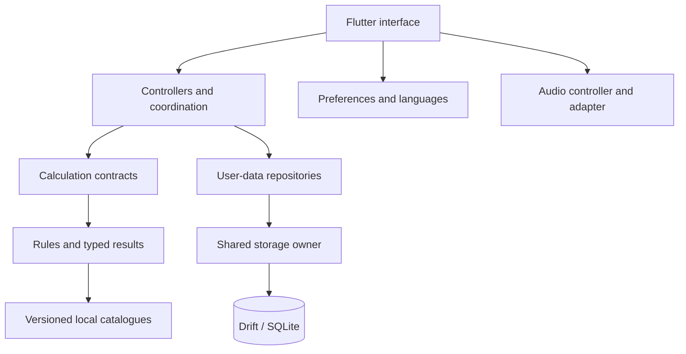
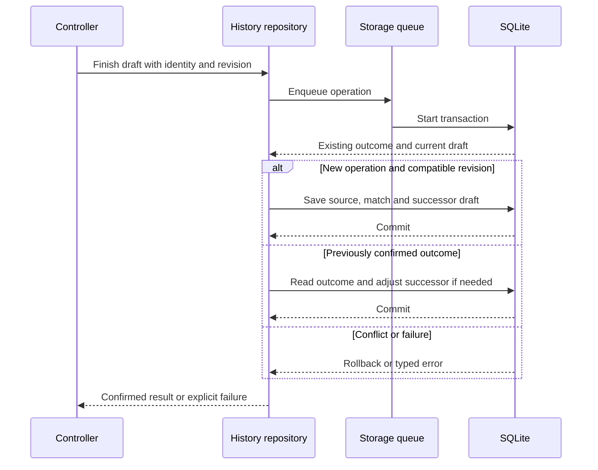

  <a href="TECHNICAL_OVERVIEW.md">Español</a> · <strong>English</strong>

# Technical overview and execution flow

[← Overview](../README.en.md) · [Documentation](README.en.md) · [Data model](DATABASE.en.md)

## System profile

**PokeChampions Core** is a Flutter application for competitive preparation and analysis, with local execution and native persistence. Its calculation unit is an explicit scenario, not an autonomous match. Architecture combines features, shared layers and replaceable contracts.

This document distinguishes **implementation observations**, **declared dependencies** and **published historical evidence**. The documentary review of 22 September 2026 does not replace running the app or auditing its complete dependency graph.

## Technology inventory

Versions below are declarations in the reviewed manifest, not certification of each APK environment. `^` denotes an allowed range. A specific Flutter or SQLite engine version is not inferred from a package name.

| Layer | Declared technology | Project use |
| --- | --- | --- |
| Interface | Flutter, Material, Dart SDK `^3.12.2` | Reusable screens and components, typed models, themes and accessibility. |
| Composition | Constructors, contracts, controllers and `InheritedWidget` | Supply repositories and services without requiring an external dependency-injection container. |
| Persistence | `drift 2.34.4`, `sqlite3 3.5.2` | Generated SQL access, schema v2, transactions and native isolate execution. |
| Directories | `path_provider 2.1.6` | Locate application-private directories. |
| Preferences | `shared_preferences ^2.5.5` | Language, appearance and music preferences; not a replacement for team/match storage. |
| Localisation | `flutter_localizations`, `intl ^0.20.2`, ARB and language JSON | Interface and ID-based terminology across eight language packages. |
| Audio | `just_audio ^0.10.6`, `audio_session ^0.2.4` | Local playback and session coordination behind contracts. |
| Generation | `drift_dev 2.34.0`, `build_runner 2.15.1` | Development-time generation, not a service running on the phone. |
| Integrity | `crypto 3.0.7`, SHA-256 and versioned artefacts | Input checks and provenance. Hashes are not encryption. |
| Quality | `flutter_test`, `test ^1.31.0`, `analyzer ^12.1.0`, `flutter_lints ^6.0.0` | Development-time tests and static analysis. |
| Delivery | Git and Flutter/Android tooling | Versioning, builds and QA flows. This does not imply a published CI/CD pipeline. |

## Responsibility map

A responsibility map, not an exhaustive import graph. Arrows indicate use/coordination; calculation does not need to save a match to return damage. [Detailed architecture](ARCHITECTURE.en.md).

## Resolving a calculation

1. The user configures participants, move and scenario conditions.
2. A controller constructs a typed request. In Versus, the port separates the consumer from the concrete facade.
3. Rules consult local catalogues and resolve the supported scope: damage, KO, survival or an explicit limitation.
4. A response returns to the interface; translated labels do not replace mechanics.

Normal Versus, Master Mode, EV Lab and 1HITKO reuse mechanical components where their questions overlap. They do not necessarily share identical search algorithms or model a complete turn.

## Saving a match

The Battle History repository includes draft completion with identity and expected-revision checks. Before writing, it checks whether the outcome already exists and whether the draft is compatible with the requested operation.

This summarises the flow, not its implementation. Recovery may return a previously confirmed result while reporting pending cleanup; it does not turn a rolled-back insertion into a successful save. Transaction boundaries, identity and idempotency are distinct from merely changing the screen.

## Concurrency and state

**Storage.** A shared owner explicitly opens the connection and coordinates operations in FIFO order. The queued unit includes the complete action—decoding and a transaction where applicable—not just individual SQL statements. A failure resolves its own operation without poisoning the queue. Closing waits for admitted operations.

**Native execution.** Opening uses a Drift isolate. It is separate from the 1HITKO calculation worker and is not a remote server. Client operation ordering remains relevant even when SQL execution is isolated.

**Search.** 1HITKO uses a worker with progress and cancellation, checking whether a job is still current before publishing results. This is not a claim that every Versus calculation runs in parallel.

**Interface.** Controllers, `ChangeNotifier`, `Future` and `Stream` are used according to responsibility. Examined SQL repositories use `get()` and `Future` operations; using Drift does not establish that all screens subscribe through `watch()`. Reactive UI and reactive SQL queries are different claims.

## Three storage groups

| Group | Contents | Authority |
| --- | --- | --- |
| **User data** | Teams, notes, history, opponents, drafts and practice records. | Shared SQLite through repositories. |
| **Interface preferences** | Language, theme and audio. | Lightweight preference storage. |
| **Game data** | Versioned catalogues and terminology. | Packaged resources prepared during development. |

Some history-specific preferences live in SQLite: `history_preferences` remembers the selected team. This is distinct from language/theme/audio.

The schema combines queryable columns with validated JSON documents: **11 tables, four explicit secondary indexes and one declared FK**. [Physical diagram, logical associations and dictionary](DATABASE.en.md).

## Connections between tools

| Tool | Input → output | Relationship to data |
| --- | --- | --- |
| Teams | Member configuration → saved team. | Scoped entities reused for later analysis. |
| Versus and Master Mode | Explicit scenario → damage and limitations. | Catalogue reads; no requirement to save every calculation. |
| EV Lab | Attack and defender → investment/survival options. | Shared rules within its scope. |
| 1HITKO | Defender and conditions → candidates. | Catalogue search; scenario transfer to Versus. |
| Battle | Doubles situation → speed order and context. | No autonomous turn sequence. |
| Lead Trainer | Teams and opening choice → practice and manual outcome. | Opponent library and rounds separate from Battle History. |
| Battle History | Declared outcome and snapshots → summary and review. | Records, draft and opponent profiles/versions. |
| Pokémon Notes | Observations/configurations → separate library. | Pokémon-identified notes, not a SQL catalogue table. |

## Localisation, audio and distribution

The interface provides Spanish, English, German, French, Italian, Portuguese, Japanese and Korean. Packages combine ARB text and ID-based terminology. Their existence does not replace testing every language/device/text-scale combination.

Audio has a concrete implementation separate from its contract and a controller coordinating state, preferences and session. Prolonged audible sessions and native behaviour retain the published QA limitations.

Public device evidence is Android. Choosing Flutter is not presented as evidence of a validated iOS, desktop or web release. This showcase does not distribute the app or activate a backend, accounts or synchronisation.

## Further reading and evidence scope

[Decisions and trade-offs](ENGINEERING.en.md) · [Validation](VALIDATION.en.md) · [Performance](PERFORMANCE.en.md) · [Data sources](DATA_AND_ACCURACY.en.md).

Metrics in those pages retain their dates. This overview is based on reading dependencies, schema, composition and repositories; it publishes no creation SQL, private source, real user records or keys. Package definitions provide context, not evidence of this application's behaviour: [Drift](https://drift.simonbinder.eu/) and [Flutter](https://docs.flutter.dev/).
