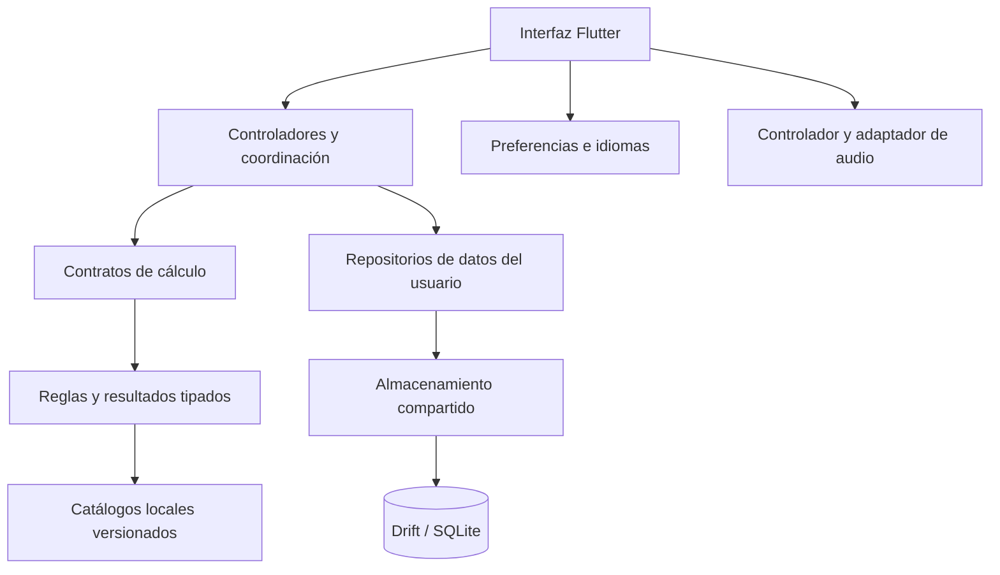
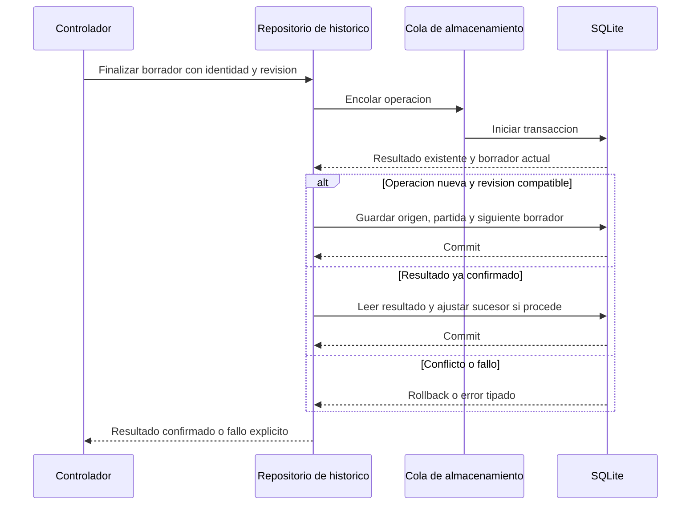

  <strong>Español</strong> · <a href="TECHNICAL_OVERVIEW.en.md">English</a>

# Ficha técnica y funcionamiento

[← Portada](../README.md) · [Documentación](README.md) · [Modelo de datos](DATABASE.md)

## Perfil del sistema

PokeChampions Core es una aplicación Flutter de preparación y análisis competitivo. Los cálculos se ejecutan con reglas y catálogos locales; los equipos, notas y partidas se guardan mediante repositorios SQLite. La arquitectura combina módulos por funcionalidad, servicios compartidos y contratos tipados.

## Inventario tecnológico

| Capa | Tecnología | Uso |
| --- | --- | --- |
| Interfaz | Flutter, Material, Dart SDK `^3.12.2` | Pantallas y componentes reutilizables, modelos tipados y temas. |
| Composición | Constructores, contratos, controladores e `InheritedWidget` | Proporcionar repositorios y servicios y compartir su ciclo de vida. |
| Persistencia | `drift 2.34.4`, `sqlite3 3.5.2` | Acceso SQL generado, esquema v2, transacciones y ejecución nativa en isolate. |
| Directorios | `path_provider 2.1.6` | Localización de los directorios privados de la aplicación. |
| Preferencias | `shared_preferences ^2.5.5` | Idioma, apariencia y ajustes de reproducción. |
| Localización | `flutter_localizations`, `intl ^0.20.2`, ARB y JSON por idioma | Textos de interfaz y terminología del juego por ID en ocho idiomas. |
| Audio | `just_audio ^0.10.6`, `audio_session ^0.2.4` | Reproducción local y coordinación de sesión mediante adaptadores. |
| Generación | `drift_dev 2.34.0`, `build_runner 2.15.1` | Generación de acceso a datos durante el desarrollo. |
| Integridad | `crypto 3.0.7`, SHA-256 y artefactos versionados | Comprobación de entradas y trazabilidad de datos. |
| Calidad | `flutter_test`, `test ^1.31.0`, `analyzer ^12.1.0`, `flutter_lints ^6.0.0` | Pruebas de lógica e interfaz y análisis estático. |
| Entrega | Git y herramientas Flutter/Android | Versionado, compilación, perfilado y QA en dispositivo. |

Versiones declaradas en el manifiesto de dependencias del 22/09/2026. `^` indica un rango compatible; las versiones resueltas y los parámetros de compilación corresponden a cada entrega.

## Mapa de responsabilidades

Los controladores coordinan las operaciones de cada pantalla. Los contratos separan el cálculo y la persistencia de sus consumidores, mientras que la composición proporciona las implementaciones concretas. [Arquitectura](ARCHITECTURE.md).

## Resolver un cálculo

La persona configura los participantes, el movimiento y las condiciones. El controlador construye una petición tipada y la entrega al servicio de cálculo. En Versus, ese límite se define mediante un puerto que permite sustituir la fachada concreta.

El evaluador aplica las reglas y consulta los catálogos locales. Devuelve el rango de daño, las condiciones de KO o los límites del escenario admitido. La interfaz representa esa respuesta utilizando los textos del idioma seleccionado; las traducciones no intervienen en la resolución de las mecánicas.

Versus normal, Modo Maestro, EV Lab y 1HITKO comparten componentes mecánicos, aunque cada herramienta tiene su propio flujo: calcular un ataque, comparar escenarios, buscar inversión defensiva o recorrer candidatos.

## Guardar una partida

HISTÓRICO finaliza cada borrador comprobando su identidad y la revisión esperada. Antes de escribir, consulta si el resultado ya existe y si el borrador sigue siendo compatible con la operación solicitada.

El registro y el siguiente borrador se coordinan en una transacción. Al repetir una operación ya confirmada, el repositorio devuelve el resultado existente en lugar de duplicarlo. Un error de escritura provoca rollback; solo una confirmación anterior puede devolverse con limpieza pendiente.

## Concurrencia y estado

**Almacenamiento.** Un propietario compartido abre la conexión y ordena las operaciones en FIFO. Cada acción encolada abarca la decodificación y la transacción que le corresponda. Un fallo termina su operación sin interrumpir la cola; el cierre espera a que finalicen las operaciones admitidas.

**Ejecución SQL.** La conexión nativa se abre en un isolate de Drift. El acceso desde los repositorios conserva la coordinación de la cola y la propiedad compartida de la conexión.

**Búsquedas.** 1HITKO usa un worker con progreso y cancelación. Antes de publicar un resultado comprueba que el trabajo siga vigente, evitando que una petición sustituida actualice la pantalla.

**Interfaz.** Los controladores utilizan `ChangeNotifier`, `Future` y `Stream` según su responsabilidad. Los repositorios SQL documentados realizan lecturas con `get()` y devuelven Futures; la actualización de la interfaz se coordina desde los controladores. Este acceso es distinto de una suscripción SQL con `watch()`.

## Almacenamiento en tres grupos

| Grupo | Contenido | Almacenamiento |
| --- | --- | --- |
| **Datos del usuario** | Equipos, notas, partidas, borradores, rivales y prácticas. | SQLite mediante repositorios compartidos. |
| **Preferencias de interfaz** | Idioma, tema y reproducción de audio. | Preferencias locales. |
| **Datos del juego** | Catálogos y terminología versionados. | Recursos empaquetados con la aplicación. |

La última selección de equipo de HISTÓRICO se conserva en `history_preferences`, dentro de SQLite. Los ajustes de idioma, tema y audio se gestionan por separado.

La base de datos combina columnas consultables con documentos JSON: **11 tablas, cuatro índices secundarios explícitos y una clave foránea declarada**. El modelo de datos detalla tanto las relaciones SQL como las asociaciones gestionadas por la aplicación. [Diagramas y diccionario](DATABASE.md).

## Conexión entre herramientas

| Herramienta | Entrada y resultado | Datos utilizados |
| --- | --- | --- |
| Equipos | Configuración de integrantes y guardado del equipo. | Entidades por ámbito, reutilizables en análisis. |
| Versus y Modo Maestro | Escenario de combate, daño y comparación. | Reglas y catálogos locales. |
| EV Lab | Ataque y defensor, opciones de inversión y supervivencia. | Componentes de cálculo compartidos. |
| 1HITKO | Defensor y condiciones, búsqueda de candidatos. | Catálogo legal y transferencia del escenario a Versus. |
| Batalla | Situación de dobles, orden por Velocidad y contexto. | Participantes y condiciones del campo. |
| Entradas | Elección inicial, práctica y resultado manual. | Biblioteca rival y registro de rondas. |
| HISTÓRICO | Resultado declarado, resúmenes y revisión. | Partidas, snapshots, borrador y perfiles/versiones de rivales. |
| Notas Pokémon | Observaciones y configuraciones reutilizables. | Biblioteca de notas identificadas por Pokémon. |

Batalla analiza una situación de dobles; la aplicación no ejecuta automáticamente los turnos de una partida. Los registros de Entradas y de HISTÓRICO se mantienen separados.

## Localización y audio

La interfaz está disponible en español, inglés, alemán, francés, italiano, portugués, japonés y coreano. Los paquetes combinan textos ARB y terminología identificada por ID.

El controlador de audio coordina la reproducción, las preferencias y la sesión. El reproductor concreto queda detrás de un contrato, lo que permite sustituirlo en pruebas y separar los detalles de la biblioteca de reproducción.

## Calidad y entrega

La aplicación se compila y prueba en Android. Las campañas de pruebas y los recorridos en dispositivo se describen en [Validación](VALIDATION.md); el análisis de arranque está en [Rendimiento](PERFORMANCE.md). Las dependencias, el esquema SQL y los datos del juego se versionan por separado.

[Decisiones de ingeniería](ENGINEERING.md) · [Datos y exactitud](DATA_AND_ACCURACY.md) · [Drift](https://drift.simonbinder.eu/) · [Flutter](https://docs.flutter.dev/)
