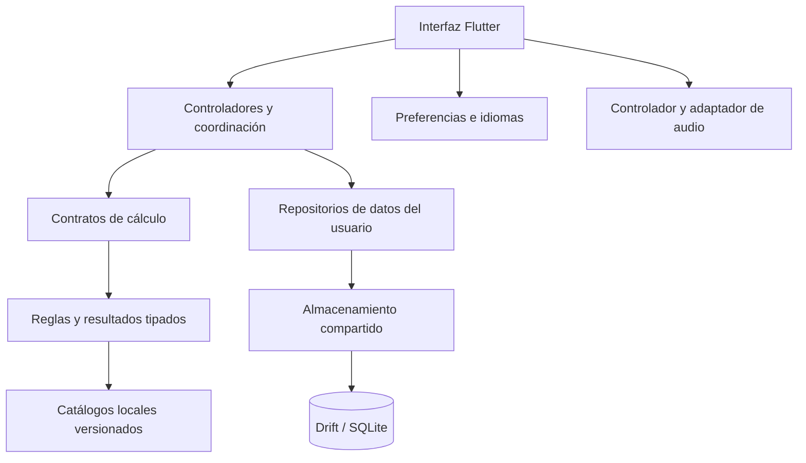
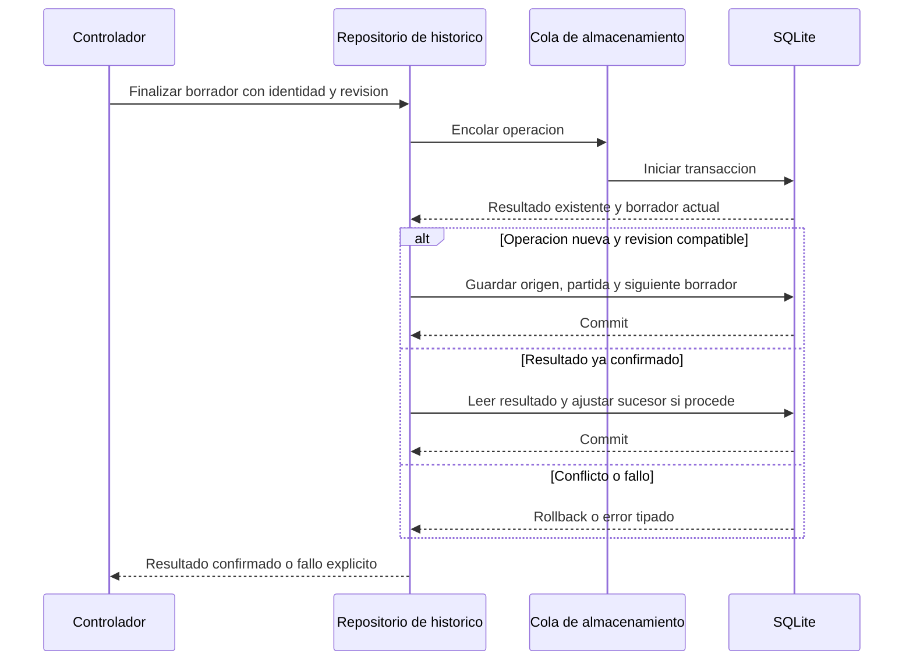

  <strong>Español</strong> · <a href="TECHNICAL_OVERVIEW.en.md">English</a>

# Ficha técnica y funcionamiento

[← Portada](../README.md) · [Documentación](README.md) · [Modelo de datos](DATABASE.md)

## Perfil del sistema

**PokeChampions Core** es una aplicación Flutter de preparación y análisis competitivo, con ejecución local y persistencia nativa. La unidad de cálculo es un escenario explícito, no una partida autónoma. La arquitectura combina funcionalidades, capas compartidas y contratos sustituibles.

Esta ficha distingue **lo observado en el código**, **lo declarado en dependencias** y **la evidencia histórica publicada**. La revisión documental del 22 de septiembre de 2026 no sustituye una ejecución de la aplicación ni una auditoría completa de todas sus dependencias.

## Inventario tecnológico

Las versiones son declaraciones del manifiesto revisado, no una certificación del entorno de cada APK. `^` expresa un rango permitido. No se infiere una versión concreta de Flutter ni del motor SQLite a partir del nombre de un paquete.

| Capa | Tecnología declarada | Uso en el proyecto |
| --- | --- | --- |
| Interfaz | Flutter, Material, Dart SDK `^3.12.2` | Pantallas y componentes reutilizables, modelos tipados, temas y accesibilidad. |
| Composición | Constructores, contratos, controladores y `InheritedWidget` | Proporcionar repositorios y servicios a sus consumidores sin un contenedor externo obligatorio. |
| Persistencia | `drift 2.34.4`, `sqlite3 3.5.2` | Acceso SQL generado, esquema v2, transacciones y ejecución nativa en isolate. |
| Directorios | `path_provider 2.1.6` | Localización de directorios privados de la aplicación. |
| Preferencias | `shared_preferences ^2.5.5` | Idioma, apariencia y preferencias musicales; no sustituye la BD de equipos o partidas. |
| Localización | `flutter_localizations`, `intl ^0.20.2`, ARB y JSON por idioma | Interfaz y terminología identificada por ID, con ocho paquetes lingüísticos. |
| Audio | `just_audio ^0.10.6`, `audio_session ^0.2.4` | Reproducción local y coordinación de sesión detrás de contratos. |
| Generación | `drift_dev 2.34.0`, `build_runner 2.15.1` | Generación durante el desarrollo, no un servicio en el teléfono. |
| Integridad | `crypto 3.0.7`, SHA-256 y artefactos versionados | Comprobación de entradas y trazabilidad. Los hashes no equivalen a cifrado. |
| Calidad | `flutter_test`, `test ^1.31.0`, `analyzer ^12.1.0`, `flutter_lints ^6.0.0` | Pruebas y análisis estático en el entorno de desarrollo. |
| Entrega | Git y herramientas Flutter/Android | Versionado, compilación y recorridos de QA. No implica una canalización CI/CD publicada. |

## Mapa de responsabilidades

Mapa de responsabilidades, no grafo exhaustivo de imports. Las flechas indican uso/coordinación; el cálculo no necesita guardar una partida para devolver daño. [Arquitectura detallada](ARCHITECTURE.md).

## Resolver un cálculo

1. La persona configura participantes, movimiento y condiciones del escenario.
2. El controlador construye una petición tipada. En Versus, el puerto separa al consumidor de la fachada concreta.
3. Las reglas consultan los catálogos locales y resuelven el alcance admitido: daño, KO, supervivencia o una limitación explícita.
4. La respuesta vuelve a la interfaz; las etiquetas traducidas no sustituyen a la mecánica.

Versus normal, Modo Maestro, EV Lab y 1HITKO reutilizan componentes mecánicos donde sus preguntas se solapan. Eso no significa que todos tengan idéntico algoritmo de búsqueda ni que modelen un turno completo.

## Guardar una partida

El repositorio de HISTÓRICO incluye una finalización de borrador con identidad y revisión esperada. Antes de escribir comprueba si el resultado ya existe y si el borrador es compatible con la operación solicitada.

Es un resumen del flujo, no su implementación. La recuperación puede devolver un resultado confirmado previamente y señalar limpieza pendiente; no convierte una inserción revertida en un guardado correcto. Los límites de transacción, identidad e idempotencia son distintos del simple cambio visual de pantalla.

## Concurrencia y estado

**Almacenamiento.** Un propietario compartido abre la conexión explícitamente y coordina las operaciones en FIFO. La unidad encolada incluye la acción completa —decodificación y transacción cuando corresponda—, no solo cada sentencia SQL. Un fallo resuelve su propia operación sin dejar inutilizable toda la cola. El cierre espera a las operaciones admitidas.

**Ejecución nativa.** La apertura usa un isolate de Drift. Es distinto del worker de cálculo de 1HITKO y no es un servidor remoto. La cola de operaciones del cliente sigue siendo relevante aunque la ejecución SQL esté aislada.

**Búsquedas.** 1HITKO utiliza un worker con progreso y cancelación, y comprueba que el trabajo siga vigente antes de publicar resultados. No se afirma que todos los cálculos de Versus se ejecuten en paralelo.

**Interfaz.** Se emplean controladores, `ChangeNotifier`, `Future` y `Stream` según la responsabilidad. Los repositorios SQL examinados usan operaciones `get()` y `Future`; disponer de Drift no demuestra que todas las pantallas estén suscritas mediante `watch()`. Reactividad de interfaz y consultas reactivas SQL no son la misma afirmación.

## Almacenamiento en tres grupos

| Grupo | Contenido | Autoridad |
| --- | --- | --- |
| **Datos del usuario** | Equipos, notas, historial, rivales, borradores y registro de prácticas. | SQLite compartido mediante repositorios. |
| **Preferencias de interfaz** | Idioma, tema y audio. | Almacenamiento ligero de preferencias. |
| **Datos del juego** | Catálogos y terminología versionados. | Recursos empaquetados y preparados durante el desarrollo. |

Hay preferencias específicas del historial en SQLite: `history_preferences` recuerda la selección de equipo. No debe confundirse con idioma/tema/audio.

El esquema combina columnas consultables con documentos JSON validados; tiene **11 tablas, cuatro índices secundarios explícitos y una FK declarada**. [Diagrama físico, asociaciones lógicas y diccionario](DATABASE.md).

## Conexión entre herramientas

| Herramienta | Entrada → salida | Relación con los datos |
| --- | --- | --- |
| Equipos | Configuración de integrantes → equipo guardado. | Entidades por ámbito; reutilización posterior en análisis. |
| Versus y Modo Maestro | Escenario explícito → daño y límites. | Consulta catálogos; no requiere guardar cada cálculo. |
| EV Lab | Ataque y defensor → opciones de inversión/supervivencia. | Comparte reglas dentro de su alcance. |
| 1HITKO | Defensor y condiciones → candidatos. | Búsqueda sobre catálogo; transfiere escenarios a Versus. |
| Batalla | Situación de dobles → orden por Velocidad y contexto. | No ejecuta una secuencia autónoma de turnos. |
| Entradas | Equipos y elección inicial → práctica y resultado manual. | Biblioteca rival y rondas separadas del HISTÓRICO. |
| HISTÓRICO | Resultado declarado y snapshots → resumen y revisión. | Registros, borrador y perfiles/versiones de rivales. |
| Notas Pokémon | Observaciones/configuraciones → biblioteca independiente. | Notas identificadas por Pokémon; no una tabla SQL del catálogo. |

## Localización, audio y distribución

La interfaz dispone de español, inglés, alemán, francés, italiano, portugués, japonés y coreano. Los paquetes combinan textos ARB y terminología por ID. Su existencia no sustituye a pruebas de todas las combinaciones de idioma, dispositivo y tamaño de texto.

Audio tiene una implementación concreta separada del contrato y un controlador que coordina estado, preferencias y sesión. Las sesiones audibles prolongadas y el comportamiento nativo conservan sus límites de QA publicados.

La evidencia pública de dispositivo es Android. No se presenta la elección de Flutter como prueba de una entrega validada en iOS, escritorio o web. El showcase no distribuye la app ni activa un backend, cuentas o sincronización.

## Lecturas y alcance de la evidencia

[Decisiones y compromisos](ENGINEERING.md) · [Validación](VALIDATION.md) · [Rendimiento](PERFORMANCE.md) · [Fuentes de datos](DATA_AND_ACCURACY.md).

Las métricas de esas páginas conservan sus fechas. Esta ficha procede de lectura de dependencias, esquema, composición y repositorios; no publica SQL de creación, código privado, datos reales ni claves. Las definiciones de paquetes son referencias de contexto, no pruebas del comportamiento concreto de la app: [Drift](https://drift.simonbinder.eu/) y [Flutter](https://docs.flutter.dev/).
